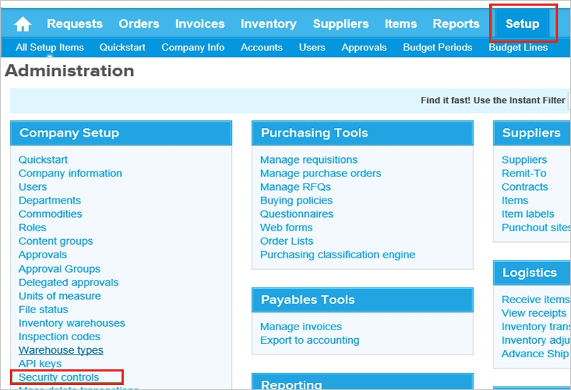
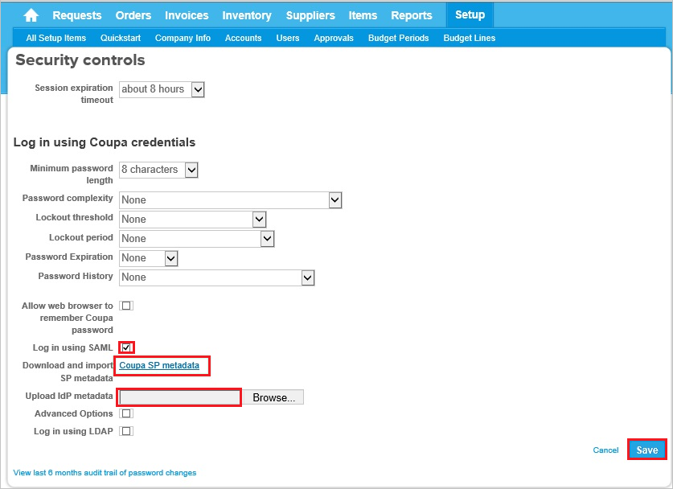

## Prerequisites

To configure Azure AD integration with Coupa, you need the following items:

- An Azure AD subscription
- A Coupa single sign-on enabled subscription

> **Note:**
> To test the steps in this tutorial, we do not recommend using a production environment.

To test the steps in this tutorial, you should follow these recommendations:

- Do not use your production environment, unless it is necessary.
- If you don't have an Azure AD trial environment, you can [get a one-month trial](https://azure.microsoft.com/pricing/free-trial/).

### Configuring Coupa for single sign-on

1. Sign on to your Coupa company site as an administrator.

2. Go to **Setup \> Security Control**.
   
   

3. In the **Log in using Coupa credentials** section, perform the following steps:

    
    
    a. Select **Log in using SAML**.
    
    b. To download the Coupa metadata file to your computer, click **Download and import SP metadata**. open the metadata and copy the **AssertionConsumerService index/URL** value, paste the value into the **Reply URL** textbox in the **Coupa Domain and URLs** section. 
    
    c. Click **Browse** to upload the **[Downloaded SAML Metadata file](%metadata:metadataDownloadUrl%)** from the Azure portal.
    
    d. Click **Save**.

## Quick Reference

* **[Download SAML Metadata file](%metadata:metadataDownloadUrl%)**

## Additional Resources

* [How to integrate Coupa with Azure Active Directory](https://docs.microsoft.com/azure/active-directory/active-directory-saas-coupa-tutorial)
