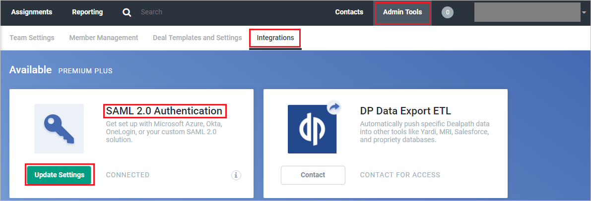
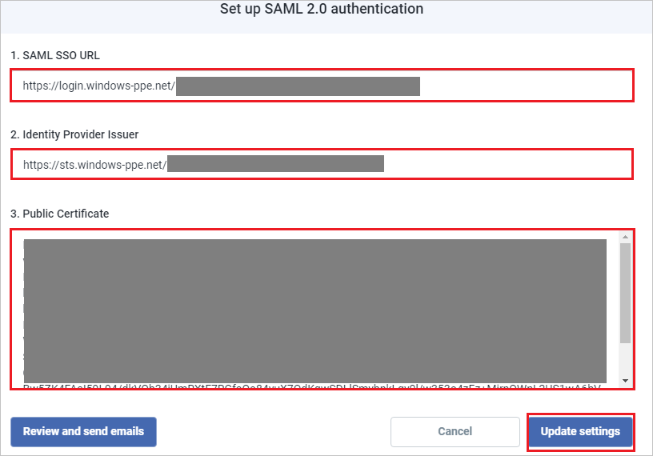

## Prerequisites

To configure Azure AD integration with Dealpath, you need the following items:

- An Azure AD subscription
- A Dealpath single sign-on enabled subscription

> **Note:**
> To test the steps in this tutorial, we do not recommend using a production environment.

To test the steps in this tutorial, you should follow these recommendations:

- Do not use your production environment, unless it is necessary.
- If you don't have an Azure AD trial environment, you can [get a one-month trial](https://azure.microsoft.com/pricing/free-trial/).

### Configuring Dealpath for single sign-on

1. In a different web browser window, login to Dealpath as an Administrator.

2. In the top right, click **Admin Tools** and navigate to **Integrations**, then in **SAML 2.0 Authentication** section click **Update Settings**:

	

3. In the **Set up SAML 2.0 authentication** page, perform the following steps:

	 

	a. In the **SAML SSO URL** textbox, paste the value of **Azure AD Single Sign-On Service URL** : %metadata:singleSignOnServiceUrl%, which you have copied from Azure portal.

	b. In the **Identity Provider Issuer** textbox, paste the value of **Azure AD SAML Entity ID** : %metadata:IssuerUri%,  which you have copied from Azure portal.

	c. Copy the content of the **[Downloaded Azure AD Signing Certifcate (Base64 encoded)](%metadata:certificateDownloadBase64Url%)** file in notepad, and then paste it into the **Public Certificate** textbox.

	d. Click **Update settings**.

## Quick Reference

* **Azure AD Single Sign-On Service URL** : %metadata:singleSignOnServiceUrl%

* **Azure AD SAML Entity ID** : %metadata:IssuerUri%

* **[Download Azure AD Signing Certifcate (Base64 encoded)](%metadata:certificateDownloadBase64Url%)**

## Additional Resources

* [How to integrate Dealpath with Azure Active Directory](https://docs.microsoft.com/azure/active-directory/active-directory-saas-dealpath-tutorial)
