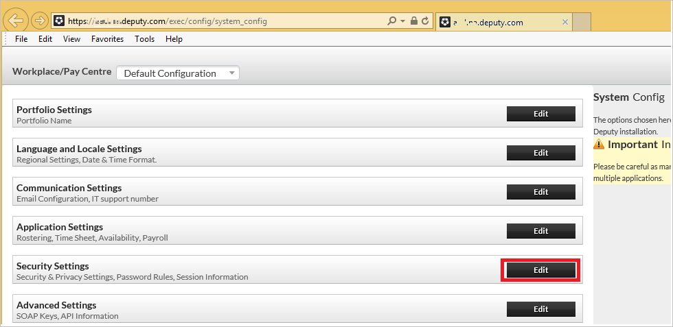
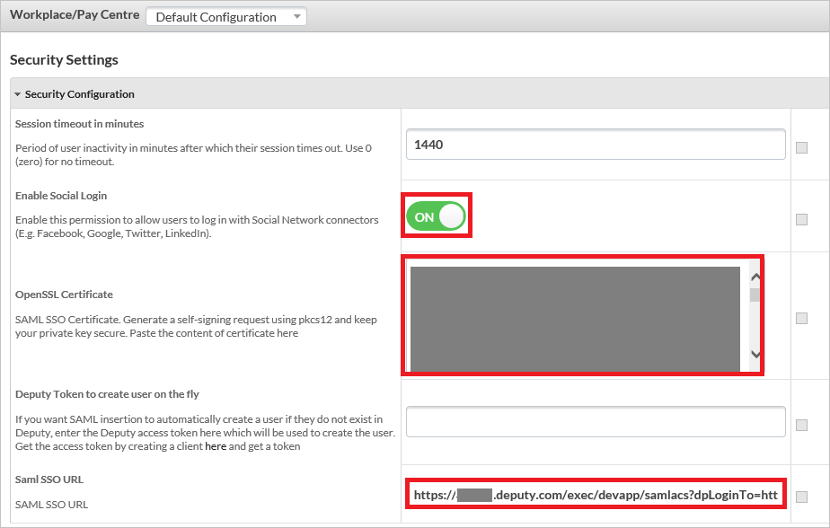

## Prerequisites

To configure Azure AD integration with Deputy, you need the following items:

- An Azure AD subscription
- A Deputy single-sign on enabled subscription

> **Note:**
> To test the steps in this tutorial, we do not recommend using a production environment.

To test the steps in this tutorial, you should follow these recommendations:

- Do not use your production environment, unless it is necessary.
- If you don't have an Azure AD trial environment, you can get a one-month trial [here](https://azure.microsoft.com/pricing/free-trial/).

### Configuring Deputy for single sign-on

1. Navigate to the following URL:[https://(your-subdomain).deputy.com/exec/config/system_config]( https://(your-subdomain).deputy.com/exec/config/system_config). Go to **Security Settings** and click **Edit**.
   
    

2. In the Azure portal, on the Configure single sign-on at Deputy page, copy the **Azure AD Single Sign-On Service URL** : %metadata:singleSignOnServiceUrl%. 

3. On this **Security Settings** page, perform below steps.

	
	
	a. Enable **Social Login**.
   
    b. Open your **[Downloaded Azure AD Signing Certifcate (Base64 encoded)](%metadata:certificateDownloadBase64Url%)** in notepad, copy the content of it into your clipboard, and then paste it to the **OpenSSL Certificate** textbox.
   
    c. In the SAM SSO URL textbox, type `https://<your subdomain>.deputy.com/exec/devapp/samlacs?dpLoginTo=<saml sso url>`
    
	d. In the SAM SSO URL textbox, replace `<your subdomain>` with your subdomain.
   
    e. In the SAM SSO URL textbox, replace `<saml sso url>` with the SAML SSO URL you have copied from the Azure portal.
   
    f. Click **Save Settings**.

## Quick Reference

* **Azure AD Single Sign-On Service URL** : %metadata:singleSignOnServiceUrl%

* **[Download Azure AD Signing Certifcate (Base64 encoded)](%metadata:certificateDownloadBase64Url%)**

## Additional Resources

* [How to integrate Deputy with Azure Active Directory](https://docs.microsoft.com/azure/active-directory/active-directory-saas-deputy-tutorial)
