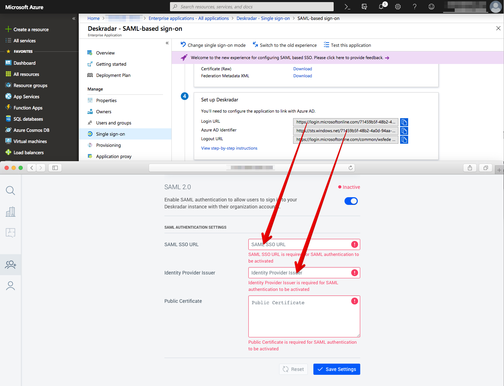
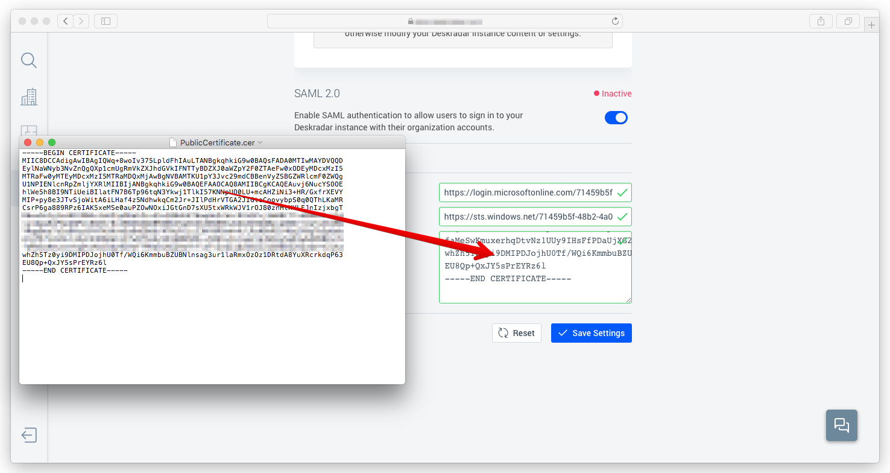

## Prerequisites

To configure Azure AD integration with Deskradar, you need the following items:

- An Azure AD subscription
- A Deskradar single sign-on enabled subscription

> **Note:**
> To test the steps in this tutorial, we do not recommend using a production environment.

To test the steps in this tutorial, you should follow these recommendations:

- Do not use your production environment, unless it is necessary.
- If you don't have an Azure AD trial environment, you can [get a one-month trial](https://azure.microsoft.com/pricing/free-trial/).

### Configuring Deskradar for single sign-on

1. Sign in to your Deskradar instance with administrator account using email and password you defined when you signed up with an invite link.

2. Open **Team** panel by clicking the icon in the Sidebar.

3. Switch to **Authentication** tab.

4. On the **SAML 2.0** tab, perform the following steps:

	

	a. Enable **SAML** authentication method.

	b. In the **SAML SSO URL** textbox, enter the **Login URL** : %metadata:singleSignOnServiceUrl% value, which you have copied from the Azure portal.

	c. In the **Identity Provider Issuer** textbox, enter the **Azure AD Identifier** : %metadata:IssuerUri% value, which you have copied from the Azure portal.

5. Open the **[Downloaded Azure AD Signing Certifcate (Base64 encoded)](%metadata:certificateDownloadBase64Url%)** file with a text editor and copy and paste its content into **Public Certificate** field in Deskradar.

	

## Quick Reference

* **Azure AD Single Sign-On Service URL** : %metadata:singleSignOnServiceUrl%

* **Azure AD Sign Out URL** : %metadata:singleSignOutServiceUrl%

* **Azure AD SAML Entity ID** : %metadata:IssuerUri%

* **[Download Azure AD Signing Certifcate (Base64 encoded)](%metadata:certificateDownloadBase64Url%)**

## Additional Resources

* [How to integrate Deskradar with Azure Active Directory](https://docs.microsoft.com/azure/active-directory/saas-apps/deskradar-tutorial)
