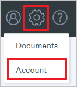
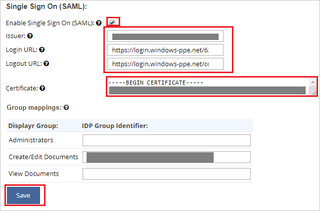

## Prerequisites

To configure Azure AD integration with Displayr, you need the following items:

- An Azure AD subscription
- A Displayr single sign-on enabled subscription

> **Note:**
> To test the steps in this tutorial, we do not recommend using a production environment.

To test the steps in this tutorial, you should follow these recommendations:

- Do not use your production environment, unless it is necessary.
- If you don't have an Azure AD trial environment, you can get a [free account](https://azure.microsoft.com/free/).

### Configuring Displayr for single sign-on

1. In a different web browser window, sign in to Displayr as an Administrator.

2. Click on **Settings** then navigate to **Account**.

	

3. Switch to **Settings** from the top menu and scroll down the page for clicking **Configure Single Sign On (SAML)**.

	

4. On the **Single Sign On (SAML)** page, perform the following steps:

	

	a. Check the **Enable Single Sign On (SAML)** box.

	b. Copy the actual **Identifier** value from the **Basic SAML Configuration** section of Azure AD and paste it into the **Issuer** text box.

	c. In the **Login URL** text box, paste the value of **Azure AD Login URL** : %metadata:singleSignOnServiceUrl%, which you have copied from Azure portal.

	d. In the **Logout URL** text box, paste the value of **Logout URL**, which you have copied from Azure portal.

	e. Open the **[Downloaded Azure AD Signing Certifcate (Base64 encoded)](%metadata:certificateDownloadBase64Url%)** in Notepad, copy its content and paste it into the **Certificate** text box.

	f. **Group mappings** are optional.

	g. Click **Save**.

## Quick Reference

* **Azure AD Login URL** : %metadata:singleSignOnServiceUrl%

* **[Download Azure AD Signing Certifcate (Base64 encoded)](%metadata:certificateDownloadBase64Url%)**

## Additional Resources

* [How to integrate Displayr with Azure Active Directory](https://docs.microsoft.com/azure/active-directory/saas-apps/displayr-tutorial)
