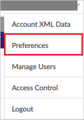
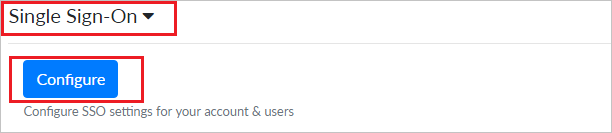
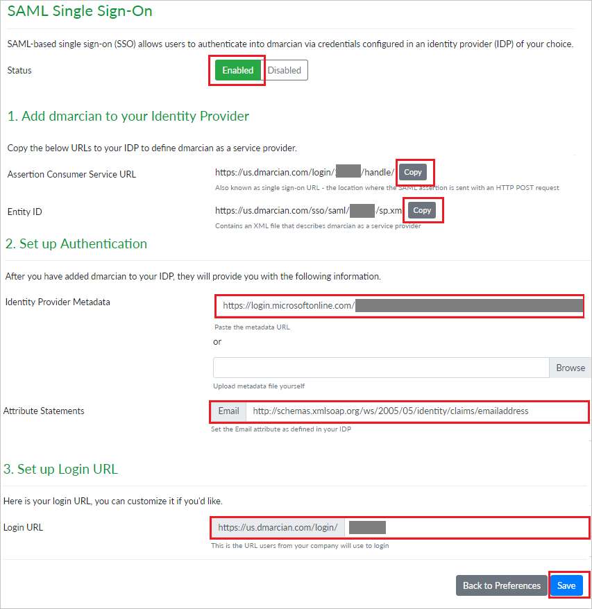

## Prerequisites

To configure Azure AD integration with dmarcian, you need the following items:

- An Azure AD subscription
- A dmarcian single sign-on enabled subscription

> **Note:**
> To test the steps in this tutorial, we do not recommend using a production environment.

To test the steps in this tutorial, you should follow these recommendations:

- Do not use your production environment, unless it is necessary.
- If you don't have an Azure AD trial environment, you can [get a one-month trial](https://azure.microsoft.com/pricing/free-trial/).

### Configuring dmarcian for single sign-on

1. In a different web browser window, sign in to dmarcian as a Security Administrator.

2. Click on **Profile** on the top right corner and navigate to **Preferences**.

	

3. Scroll down and click on **Single Sign-On** section, then click on **Configure**.

	

4. On the **SAML Single Sign-On** page set the **Status** as **Enabled** and perform the following steps:

	

	* Under **Add dmarcian to your Identity Provider** section, click **COPY** to copy the **Assertion Consumer Service URL** for your instance and paste it in **Reply URL** textbox in **dmarcian Domain and URLs section** on Azure portal.

	* Under **Add dmarcian to your Identity Provider** section, click **COPY** to copy the **Entity ID** for your instance and paste it in **Identifier** textbox in **dmarcian Domain and URLs section** on Azure portal.

	* Under **Set up Authentication** section, in the **Identity Provider Metadata** textbox paste the **App Federation Metadata Url**, which you have copied from Azure portal.

	* Under **Set up Authentication** section, in the **Attribute Statements** textbox paste the url `http://schemas.xmlsoap.org/ws/2005/05/identity/claims/emailaddress`.

	* Under **Set up Login URL** section, copy the **Login URL** for your instance and paste it in **Sign-on URL** textbox in **dmarcian Domain and URLs section** on Azure portal.

		> [!Note]
		> You can modify the **Login URL** according to your organisation.

	* Click **Save**.

## Quick Reference

* **[Download Azure AD Signing Certifcate](%metadata:CertificateDownloadRawUrl%)**

* **[Download SAML Metadata file](%metadata:metadataDownloadUrl%)**

## Additional Resources

* [How to integrate dmarcian with Azure Active Directory](https://docs.microsoft.com/azure/active-directory/saas-apps/dmarcian-tutorial)
