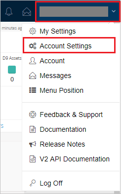
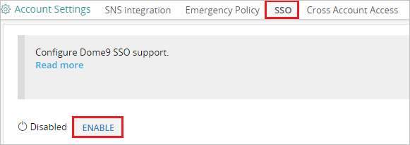
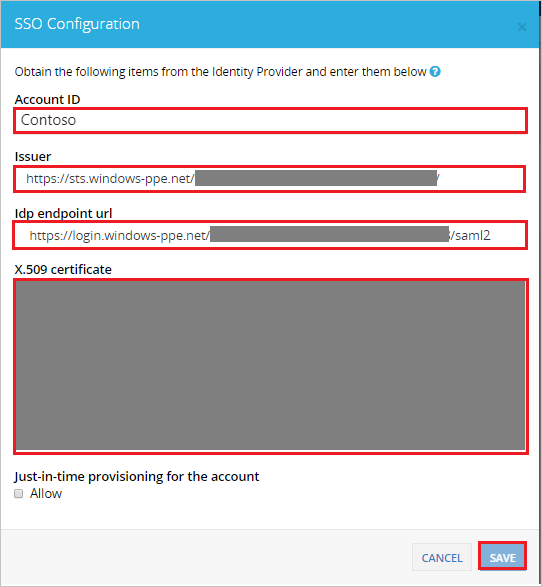

## Prerequisites

To configure Azure AD integration with Dome9 Arc, you need the following items:

- An Azure AD subscription
- A Dome9 Arc single sign-on enabled subscription

> **Note:**
> To test the steps in this tutorial, we do not recommend using a production environment.

To test the steps in this tutorial, you should follow these recommendations:

- Do not use your production environment, unless it is necessary.
- If you don't have an Azure AD trial environment, you can [get a one-month trial](https://azure.microsoft.com/pricing/free-trial/).

### Configuring Dome9 Arc for single sign-on

1. In a different web browser window, log into your Dome9 Arc company site as an administrator.

2. Click on the **Profile Settings** on the right top corner and then click **Account Settings**. 

	

3. Navigate to **SSO** and then click **ENABLE**.

	

4. In the SSO Configuration section, perform the following steps:

	

	a. Enter company name in the **Account ID** textbox. This value is to be used in the reply url mentioned in the Azure portal URL section.

	b. In the **Issuer** textbox, paste the value of **Azure AD SAML Entity ID** : %metadata:IssuerUri%, which you have copied form the Azure portal.

	c. In the **Idp endpoint url** textbox, paste the value of **Azure AD Single Sign-On Service URL** : %metadata:singleSignOnServiceUrl%, which you have copied form the Azure portal.

	d. Open your **[Downloaded Azure AD Signing Certifcate (Base64 encoded)](%metadata:certificateDownloadBase64Url%)** in notepad, copy the content of it into your clipboard, and then paste it to the **X.509 certificate** textbox.

	e. Click **Save**.

## Quick Reference

* **Azure AD Single Sign-On Service URL** : %metadata:singleSignOnServiceUrl%

* **Azure AD SAML Entity ID** : %metadata:IssuerUri%

* **[Download Azure AD Signing Certifcate (Base64 encoded)](%metadata:certificateDownloadBase64Url%)**

## Additional Resources

* [How to integrate Dome9 Arc with Azure Active Directory](https://docs.microsoft.com/azure/active-directory/active-directory-saas-dome9arc-tutorial)
