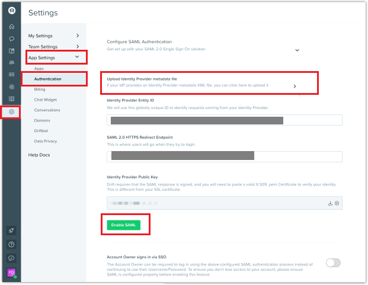

## Prerequisites

To configure Azure AD integration with Drift, you need the following items:

- An Azure AD subscription
- A Drift single sign-on enabled subscription

> **Note:**
> To test the steps in this tutorial, we do not recommend using a production environment.

To test the steps in this tutorial, you should follow these recommendations:

- Do not use your production environment, unless it is necessary.
- If you don't have an Azure AD trial environment, you can [get a one-month trial](https://azure.microsoft.com/pricing/free-trial/).

### Configuring Drift for single sign-on

1. In a different web browser window, login to Drift as an Administrator.

2. From the left side of menu bar, click on **Settings icon** > **App Settings** > **Authentication** and perform the following steps:

	

	a. Upload the **[Downloaded SAML Metadata file](%metadata:metadataDownloadUrl%)** from the Azure portal, into the **Upload Identity Provider metadata file** text box.

	b. After uploading the metadata file, the remaining values get auto populated on the page automatically.

	c. Click **Enable SAML**.

## Quick Reference

* **[Download Azure AD Signing Certifcate](%metadata:CertificateDownloadRawUrl%)**

* **[Download SAML Metadata file](%metadata:metadataDownloadUrl%)**

## Additional Resources

* [How to integrate Drift with Azure Active Directory](https://docs.microsoft.com/azure/active-directory/saas-apps/drift-tutorial)
