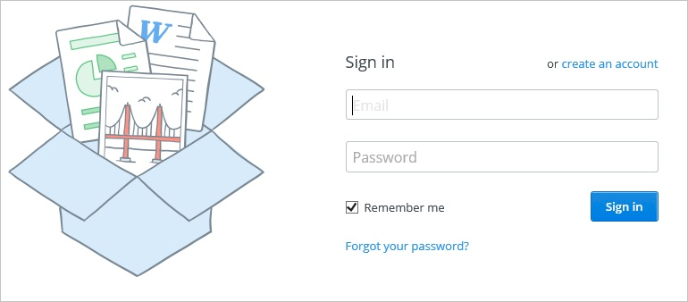
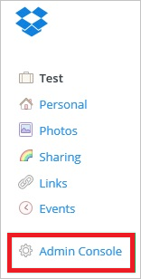
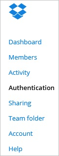
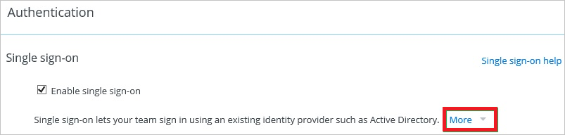
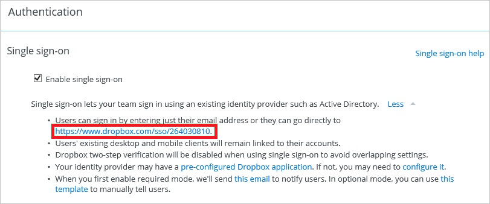
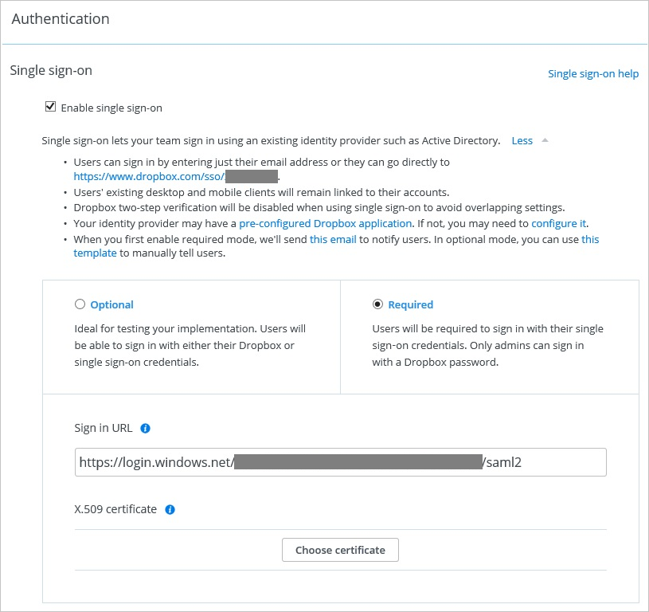

## Prerequisites
The objective of this tutorial is to show the integration of Azure and Dropbox for Business.  
The scenario outlined in this tutorial assumes that you already have the following items:

* A valid Azure subscription
* A test tenant in Dropbox for Business

After completing this tutorial, the Azure AD users you have assigned to Dropbox for Business will be able to single sign into the application at your Dropbox for Business company site (service provider initiated sign on), or using the [Introduction to the Access Panel](active-directory-saas-access-panel-introduction.md).

## Configuring single sign-on
The objective of this section is to outline how to enable users to authenticate to Dropbox for Business with their account in Azure AD using federation based on the SAML protocol.

As part of this procedure, you are required to upload a base-64 encoded certificate to your Dropbox for Business tenant. If you are not familiar with this procedure, see [How to convert a binary certificate into a text file](http://youtu.be/PlgrzUZ-Y1o).

### To configure single sign-on, perform the following steps:

1. Sign-on to your Dropbox for business tenant. 
   
	
   
2. In the navigation pane on the left side, click **Admin Console**. 
   
	
   
3. On the **Admin Console**, click **Authentication** in the left navigation pane. 
   
	
   
4. In the **Single sign-on** section, select **Enable single sign-on**, and then click **More** to expand this section.  
   
	
   
5. Copy the URL next to **Users can sign in by entering their email address or they can go directly to**. 
   
	
   
6. In the Azure portal, ensure the copied URL matches the Sign-On URL. 
	
7. On your Dropbox for Business tenant, in the **Single sign-on** section of the **Authentication** page, perform the following steps: 
   
    
   
    a. Click **Required**.
   
    b. Paste the following URL into the **Sign in URL** textbox: **%metadata:singleSignOnServiceUrl%**
	
	c. Download the Azure AD signing certificate for your Dropbox tenant here: **[Azure AD Signing Certificate](%metadata:certificateDownloadBase64Url%)**

    d. Create a **Base-64 encoded** file from your downloaded certificate, following the instructions [here](http://youtu.be/PlgrzUZ-Y1o).

    e. Click **Choose certificate**, and then browse to your **base-64 encoded certificate file**.

    f. Click **Save changes** to complete the configuration on your DropBox for Business tenant.
 
