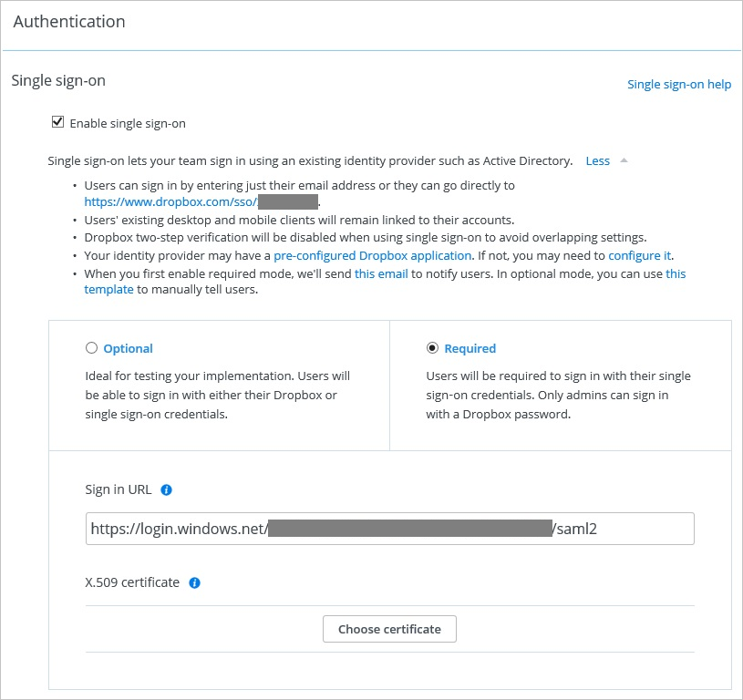

## Prerequisites

To configure Azure AD integration with Dropbox for Business, you need the following items:

- An Azure AD subscription
- A Dropbox for Business single-sign on enabled subscription

> **Note:**
> To test the steps in this tutorial, we do not recommend using a production environment.

To test the steps in this tutorial, you should follow these recommendations:

- Do not use your production environment, unless it is necessary.
- If you don't have an Azure AD trial environment, you can get a one-month trial [here](https://azure.microsoft.com/pricing/free-trial/).

### Configuring Dropbox for Business for single sign-on

1. To configure single sign-on on **Dropbox for Business** side, Go on your Dropbox for Business tenant, in the **Single sign-on** section of the **Authentication** page, perform the following steps: 
   
    
   
    a. Click **Required**.
   
    b. In the Azure portal, on the **Configure sign-on** window, copy the **Azure AD Single Sign-On Service URL**: %metadata:singleSignOnServiceUrl% value, and then paste it into the **Sign-in URL** textbox.

    c. Click **Choose certificate**, and then browse to your **[Download Azure AD Signing Certificate (Base64 encoded)](%metadata:certificateDownloadBase64Url%)**.

    d. Click **Save changes** to complete the configuration on your DropBox for Business tenant.

## Quick Reference

* **Azure AD Single Sign-On Service URL**: %metadata:singleSignOnServiceUrl%

* **[Download Azure AD Signing Certificate (Base64 encoded)](%metadata:certificateDownloadBase64Url%)**

## Additional Resources

* [How to integrate Dropbox for Business with Azure Active Directory](active-directory-saas-dropboxforbusiness-tutorial.md)
* [How to configure user provisioning with Dropbox for Business](active-directory-saas-dropboxforbusiness-user-provisioning-tutorial.md)
