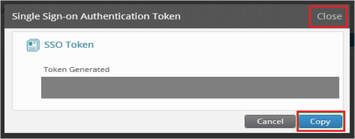

## Prerequisites

To configure Azure AD integration with Druva, you need the following items:

- An Azure AD subscription
- A Druva single-sign on enabled subscription

> **Note:**
> To test the steps in this tutorial, we do not recommend using a production environment.

To test the steps in this tutorial, you should follow these recommendations:

- Do not use your production environment, unless it is necessary.
- If you don't have an Azure AD trial environment, you can get a one-month trial [here](https://azure.microsoft.com/pricing/free-trial/).

### Configuring Druva for single sign-on

1. In a different web browser window, log in to your Druva company site as an administrator.

2. Go to **Manage \> Settings**.

	

3. On the Single Sign-On Settings dialog, perform the following steps:

	
	
	a. Paste **Azure AD Single Sign-On Service URL** : %metadata:singleSignOnServiceUrl% into the **ID Provider Login URL** textbox.
	
	b. Paste **Azure AD Sign Out URL** : %metadata:singleSignOutServiceUrl% into the **ID Provider Logout URL** textbox.
	
	 c. Open your **[Downloaded Azure AD Signing Certifcate (Base64 encoded)](%metadata:certificateDownloadBase64Url%)** in notepad, copy the content of it into your clipboard, and then paste it to the **ID Provider Certificate** textbox
	 
	 d. To open the **Settings** page, click **Save**.

4. On the **Settings** page, click **Generate SSO Token**.

	

5. On the **Single Sign-on Authentication Token** dialog, perform the following steps:

	
	
	a. Click **Copy**.
	
	b. Click **Close**.

## Quick Reference

* **Azure AD Single Sign-On Service URL** : %metadata:singleSignOnServiceUrl%

* **Azure AD Sign Out URL** : %metadata:singleSignOutServiceUrl%

* **[Download Azure AD Signing Certifcate (Base64 encoded)](%metadata:certificateDownloadBase64Url%)**

## Additional Resources

* [How to integrate Druva with Azure Active Directory](https://docs.microsoft.com/azure/active-directory/active-directory-saas-druva-tutorial)
