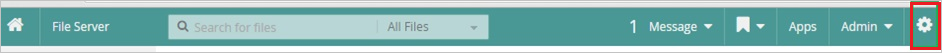
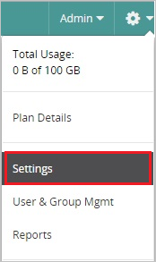
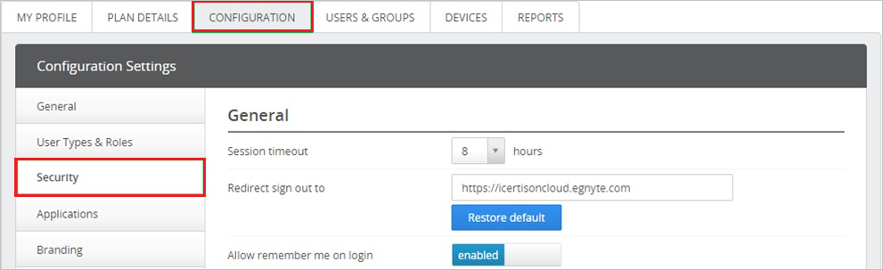
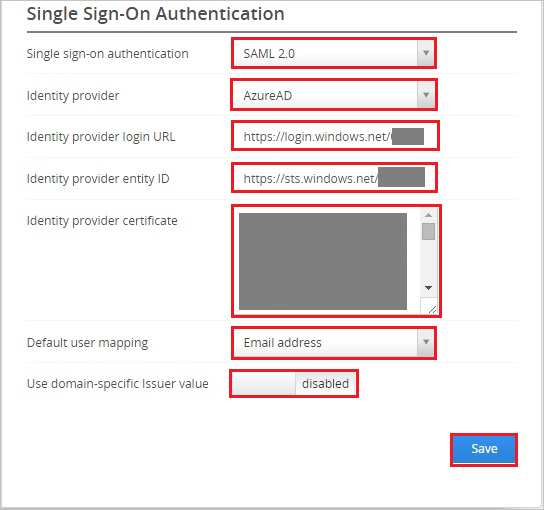

## Prerequisites

To configure Azure AD integration with Egnyte, you need the following items:

- An Azure AD subscription
- A Egnyte single sign-on enabled subscription

> **Note:**
> To test the steps in this tutorial, we do not recommend using a production environment.

To test the steps in this tutorial, you should follow these recommendations:

- Do not use your production environment, unless it is necessary.
- If you don't have an Azure AD trial environment, you can get a one-month trial [here](https://azure.microsoft.com/pricing/free-trial/).

### Configuring Egnyte for single sign-on

1. In a different web browser window, log in to your Egnyte company site as an administrator.

2. Click **Settings**.
   
   

3. In the menu, click **Settings**.

   

4. Click the **Configuration** tab, and then click **Security**.

	

5. In the **Single Sign-On Authentication** section, perform the following steps:

	   
	
	a. As **Single sign-on authentication**, select **SAML 2.0**.
   
    b. As **Identity provider**, select **AzureAD**.
   
    c. Paste **Azure AD Single Sign-On Service URL** : %metadata:singleSignOnServiceUrl% copied from Azure portal into the **Identity provider login URL** textbox.
   
    d. Paste **Azure AD SAML Entity ID** : %metadata:IssuerUri% which you have copied from Azure portal into the **Identity provider entity ID** textbox.
      
	e. Open your **[Downloaded Azure AD Signing Certifcate (Base64 encoded)](%metadata:certificateDownloadBase64Url%)** in notepad downloaded from Azure portal, copy the content of it into your clipboard, and then paste it to the **Identity provider certificate** textbox.
   
    f. As **Default user mapping**, select **Email address**.
   
    g. As **Use domain-specific issuer value**, select **disabled**.
   
    h. Click **Save**.

## Quick Reference

* **Azure AD Single Sign-On Service URL** : %metadata:singleSignOnServiceUrl%

* **Azure AD SAML Entity ID** : %metadata:IssuerUri%

* **[Download Azure AD Signing Certifcate (Base64 encoded)](%metadata:certificateDownloadBase64Url%)**

## Additional Resources

* [How to integrate Egnyte with Azure Active Directory](https://docs.microsoft.com/azure/active-directory/active-directory-saas-egnyte-tutorial)
