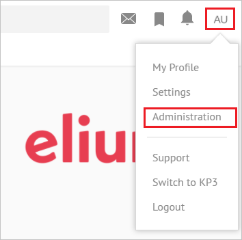
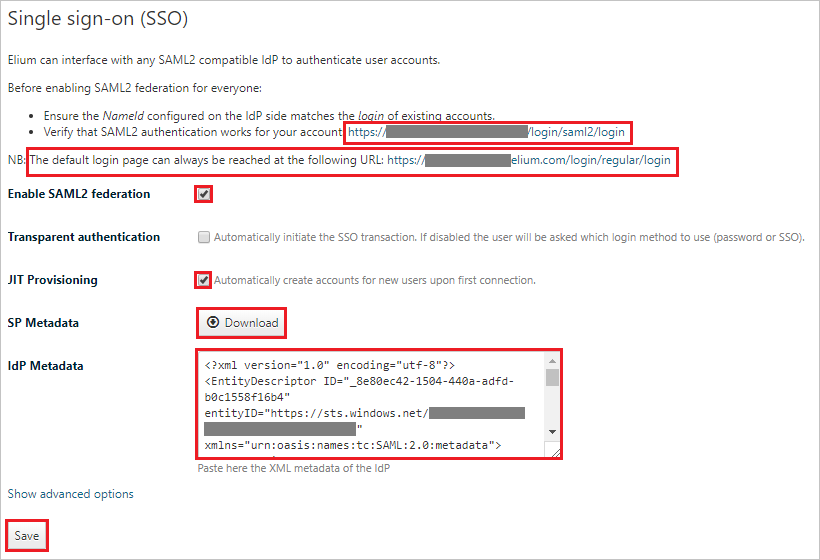
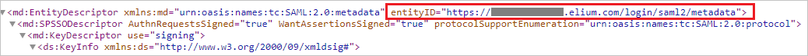
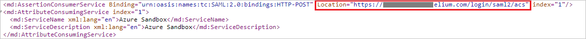

## Prerequisites

To configure Azure AD integration with Elium, you need the following items:

- An Azure AD subscription
- A Elium single sign-on enabled subscription

> **Note:**
> To test the steps in this tutorial, we do not recommend using a production environment.

To test the steps in this tutorial, you should follow these recommendations:

- Do not use your production environment, unless it is necessary.
- If you don't have an Azure AD trial environment, you can [get a one-month trial](https://azure.microsoft.com/pricing/free-trial/).

### Configuring Elium for single sign-on

1. In a different web browser window, log in to your Elium company site as an administrator.

2. Click on the **User profile** from right top corner and then select **Administration**.

	

3. Select **Security** tab.

	

4. Scroll down to the **Single sign-on (SSO)** section and perform the following steps:

	

	a. Copy the value of **Verify that SAML2 authentication works for your account** and paste it in the **Sign-on URL** textbox on the **Elium Domain and URLs** section in the Azure portal.

	> [!NOTE]
	> After configuring SSO, you can always access the default remote login page at the following URL: `https://<platform_domain>/login/regular/login` 

	b. Select **Enable SAML2 federation** checkbox.

	c. Select **JIT Provisioning** checkbox.

	d. Open the **SP Metadata** by clicking on the **Download** button.

	e. Search for the **entityID** in the **SP Metadata** file, copy the **entityID** value and paste it in the **Identifier** textbox on the **Elium Domain and URLs** section in the Azure portal. 

	

	f. Search for the **AssertionConsumerService** in the **SP Metadata** file, copy the **Location** value and paste it in the **Reply URL** textbox on the **Elium Domain and URLs** section in the Azure portal.

	

	g. Open the **[Downloaded SAML Metadata file](%metadata:metadataDownloadUrl%)** from Azure portal into notepad, copy the content and paste it into the **IdP Metadata** textbox.

	h. Click **Save**.

## Quick Reference

* **[Download SAML Metadata file](%metadata:metadataDownloadUrl%)**

## Additional Resources

* [How to integrate Elium with Azure Active Directory](https://docs.microsoft.com/azure/active-directory/active-directory-saas-elium-tutorial)
