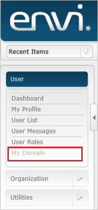
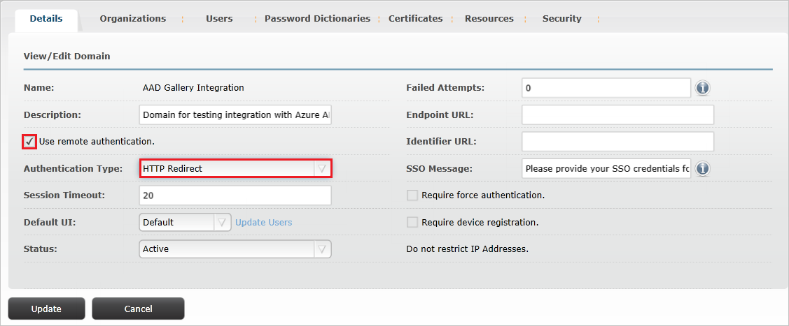
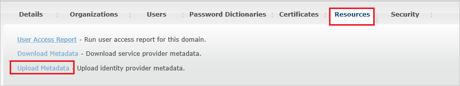
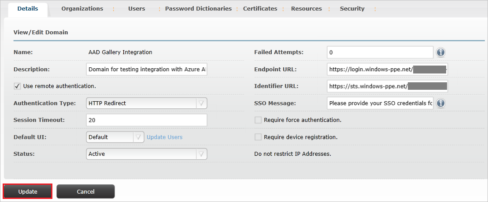

## Prerequisites

To configure Azure AD integration with Envi MMIS, you need the following items:

- An Azure AD subscription
- A Envi MMIS single sign-on enabled subscription

> **Note:**
> To test the steps in this tutorial, we do not recommend using a production environment.

To test the steps in this tutorial, you should follow these recommendations:

- Do not use your production environment, unless it is necessary.
- If you don't have an Azure AD trial environment, you can [get a one-month trial](https://azure.microsoft.com/pricing/free-trial/).

### Configuring Envi MMIS for single sign-on

1. In a different web browser window, log into your Envi MMIS site as an administrator.

2. Click on **My Domain** tab.

	

3. Click **Edit**.

	

4. Select **Use remote authentication** checkbox and then select **HTTP Redirect** from the **Authentication Type** dropdown.

	

5. Select **Resources** tab and then click **Upload Metadata**.

	

6. In the **Upload Metadata** popup, perform the following steps:

	

	a. Select **File** option from the **Upload From** dropdown.

	b. Upload the **[Downloaded SAML Metadata file](%metadata:metadataDownloadUrl%)** from Azure portal by selecting the **choose file icon**.

	c. Click **Ok**.

7. After uploading the downloaded metadata file the fields will get populated automatically. Click **Update**

	

## Quick Reference

* **[Download SAML Metadata file](%metadata:metadataDownloadUrl%)**

## Additional Resources

* [How to integrate Envi MMIS with Azure Active Directory](https://docs.microsoft.com/azure/active-directory/active-directory-saas-envimmis-tutorial)
