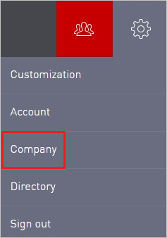
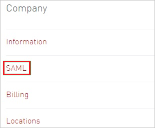
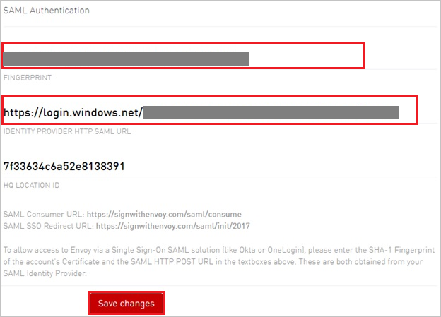

## Prerequisites

To configure Azure AD integration with Envoy, you need the following items:

- An Azure AD subscription
- A Envoy single sign-on enabled subscription

> **Note:**
> To test the steps in this tutorial, we do not recommend using a production environment.

To test the steps in this tutorial, you should follow these recommendations:

- Do not use your production environment, unless it is necessary.
- If you don't have an Azure AD trial environment, you can [get a one-month trial](https://azure.microsoft.com/pricing/free-trial/).

### Configuring Envoy for single sign-on

1. In a different web browser window, log into your Envoy company site as an administrator.

2. In the toolbar on the top, click **Settings**.

	

3. Click **Company**.

	

4. Click **SAML**.

	

5. In the **SAML Authentication** configuration section, perform the following steps:

	
	
	>[!NOTE]
	>The value for the HQ location ID is auto generated by the application.
	
	a. In **Fingerprint** textbox, paste the **Thumbprint** value of certificate, which you have copied from Azure portal.
	
	b. Paste **Azure AD Single Sign-On Service URL** : %metadata:singleSignOnServiceUrl% value, which you have copied form the Azure portal into the **IDENTITY PROVIDER HTTP SAML URL** textbox.
	
	c. Click **Save changes**.

## Quick Reference

* **Azure AD Single Sign-On Service URL** : %metadata:singleSignOnServiceUrl%

* **[Download Azure AD Signing Certifcate](%metadata:CertificateDownloadRawUrl%)**

## Additional Resources

* [How to integrate Envoy with Azure Active Directory](https://docs.microsoft.com/azure/active-directory/active-directory-saas-envoy-tutorial)
