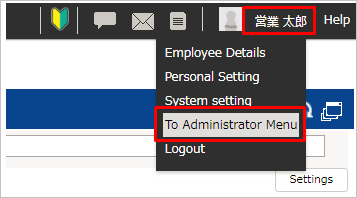
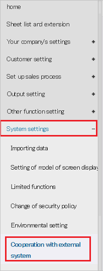
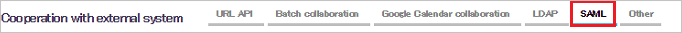
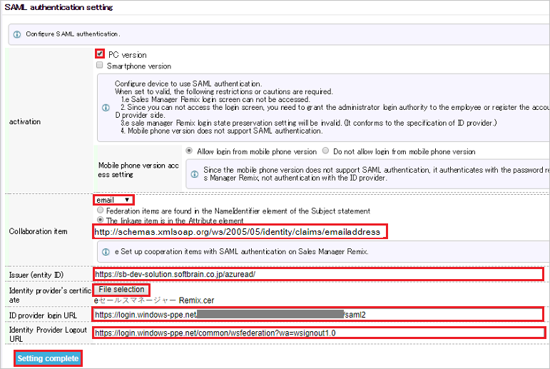

## Prerequisites

To configure Azure AD integration with e Sales Manager Remix, you need the following items:

- An Azure AD subscription
- A e Sales Manager Remix single sign-on enabled subscription

> **Note:**
> To test the steps in this tutorial, we do not recommend using a production environment.

To test the steps in this tutorial, you should follow these recommendations:

- Do not use your production environment, unless it is necessary.
- If you don't have an Azure AD trial environment, you can [get a one-month trial](https://azure.microsoft.com/pricing/free-trial/).

### Configuring e Sales Manager Remix for single sign-on

1. Sign on to your E Sales Manager Remix application as an administrator.

2. Select **To Administrator Menu** from the menu at the top right.

	

3. Select **System settings**>**Cooperation with external system**

	
	
4. Select **SAML**

	

5. In the **SAML authentication setting** section, perform the following steps:

	
	
	a. Select **PC version**
	
	b. Select **email** from the dropdown in the Collaboration item section.

	c. In the Collaboration item textbox, paste the **Namespace** value that you have copied from the Azure portal i.e `http://schemas.xmlsoap.org/ws/2005/05/identity/claims/emailaddress`

	d. In the **Issuer (entity ID)** textbox, paste the **Identifier** value that you have copied from the Azure portal of **E Sales Manager Remix Domain and URLs** section.

	e. To upload your **[Downloaded Azure AD Signing Certifcate (Base64 encoded)](%metadata:certificateDownloadBase64Url%)** from the Azure portal, select **File selection**.

	f. In **ID provider login URL** textbox, paste **Azure AD Single Sign-On Service URL** : %metadata:singleSignOnServiceUrl% that you have copied from Azure portal.

	g. In **Identity Provider Logout URL** textbox, paste **Azure AD Sign Out URL** : %metadata:singleSignOutServiceUrl% value that you have copied from Azure portal.

	h. Click **Setting complete**

## Quick Reference

* **Azure AD Single Sign-On Service URL** : %metadata:singleSignOnServiceUrl%

* **Azure AD SAML Entity ID** : %metadata:IssuerUri%

* **Azure AD Sign Out URL** : %metadata:singleSignOutServiceUrl%

* **[Download Azure AD Signing Certifcate (Base64 encoded)](%metadata:certificateDownloadBase64Url%)**

## Additional Resources

* [How to integrate e Sales Manager Remix with Azure Active Directory](https://docs.microsoft.com/azure/active-directory/active-directory-saas-esalesmanagerremix-tutorial)
