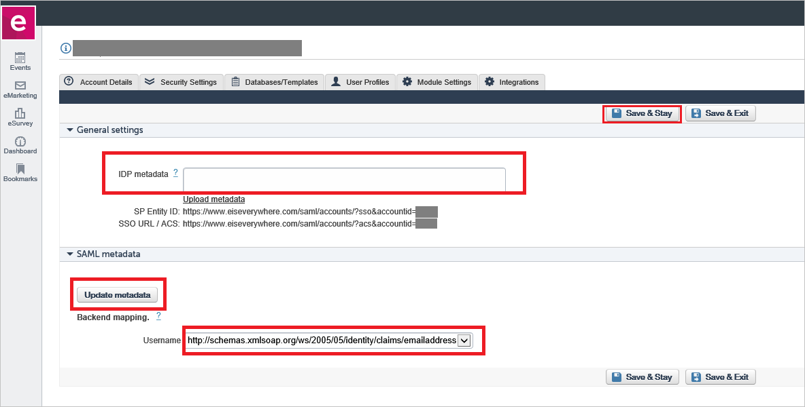

## Prerequisites

To configure Azure AD integration with etouches, you need the following items:

- An Azure AD subscription
- A etouches single sign-on enabled subscription

> **Note:**
> To test the steps in this tutorial, we do not recommend using a production environment.

To test the steps in this tutorial, you should follow these recommendations:

- Do not use your production environment, unless it is necessary.
- If you don't have an Azure AD trial environment, you can get a one-month trial [here](https://azure.microsoft.com/pricing/free-trial/).

### Configuring etouches for single sign-on

1. To get SSO configured for your application, perform the following steps in the etouches application: 

     

    a. Login to **etouches** application using the Admin rights.
   
    b. Go to the **SAML** Configuration.

    c. In the **General Settings** section, open your **[Downloaded Azure AD Signing Certifcate](%metadata:CertificateDownloadRawUrl%)** from Azure portal in notepad, copy the content, and then paste it into the IDP metadata textbox. 

    d. Click on the **Save & Stay** button.
  
    e. Click on the **Update Metadata** button in the SAML Metadata section. 

    f. This opens the page and perform SSO. Once the SSO is working then you can set up the username.

    g. In the Username field, select the **emailaddress** as shown in the image below. 

    h. Copy the **SP entity ID** value and paste it into the **Identifier**  textbox, which is in **etouches Domain and URLs** section on Azure portal.

	i. Copy the **SSO URL / ACS** value and paste it into the **Sign on URL** textbox, which is in **etouches Domain and URLs** section on Azure portal.

## Quick Reference

* **[Download Azure AD Signing Certifcate](%metadata:CertificateDownloadRawUrl%)**

* **[Download SAML Metadata file](%metadata:metadataDownloadUrl%)**

## Additional Resources

* [How to integrate etouches with Azure Active Directory](https://docs.microsoft.com/azure/active-directory/active-directory-saas-etouches-tutorial)
