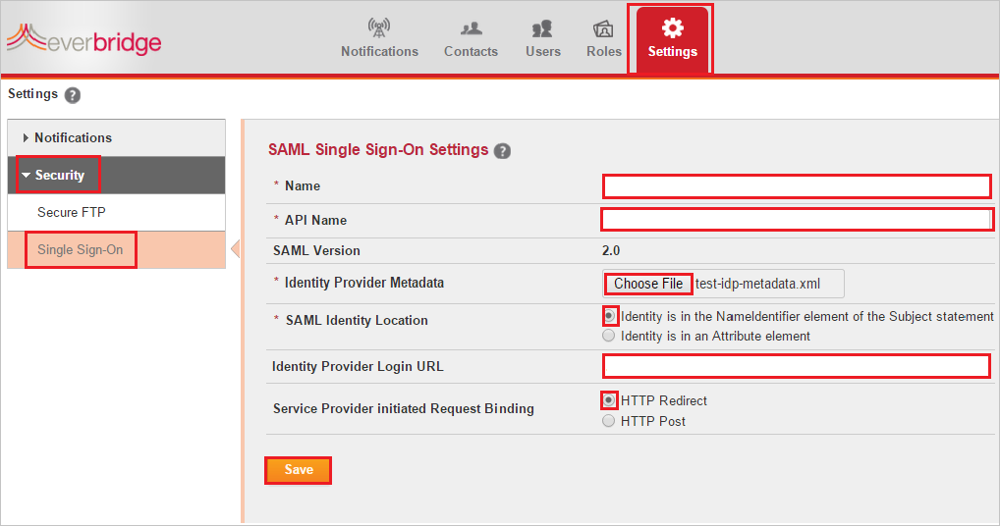

## Prerequisites

To configure Azure AD integration with EverBridge, you need the following items:

- An Azure AD subscription
- An EverBridge single sign-on enabled subscription

> **Note:**
> To test the steps in this tutorial, we do not recommend using a production environment.

To test the steps in this tutorial, you should follow these recommendations:

- Do not use your production environment, unless it is necessary.
- If you don't have an Azure AD trial environment, you can [get a one-month trial](https://azure.microsoft.com/pricing/free-trial/).

### Configuring EverBridge for single sign-on

1. To get SSO configured for **EverBridge** as **EverBridge Manager Portal** application, perform the following steps: 
 
2. In a different web browser window, login to EverBridge as an Administrator.

3. In the menu on the top, click the **Settings** tab and select **Single Sign-On** under **Security**.
   
    
   
    a. In the **Name** textbox, type the name of Identifier Provider (for example: your company name).
   
    b. In the **API Name** textbox, type the name of API.
   
    c. Click **Choose File** button to upload the **[Downloaded SAML Metadata file](%metadata:metadataDownloadUrl%)** from Azure portal.
   
    d. In the SAML Identity Location, select **Identity is in the NameIdentifier element of the Subject statement**.
   
    e. In the **Identity Provider Login URL** textbox, paste the value of **Login URL** : %metadata:singleSignOnServiceUrl% which you have copied from Azure portal.
   
    f. In the Service Provider Initiated Request Binding, select **HTTP Redirect**.

	g. Click **Save**

4. To configure single sign-on on **EverBridge** application as **EverBridge Member Portal**, you need to send the downloaded **Federation Metadata XML** to [Everbridge support team](mailto:support@everbridge.com). They set this setting to have the SAML SSO connection set properly on both sides.

## Quick Reference

* **Azure AD Single Sign-On Service URL** : %metadata:singleSignOnServiceUrl%

* **[Download Azure AD Signing Certifcate](%metadata:CertificateDownloadRawUrl%)**

* **[Download SAML Metadata file](%metadata:metadataDownloadUrl%)**

## Additional Resources

* [How to integrate EverBridge with Azure Active Directory](https://docs.microsoft.com/azure/active-directory/saas-apps/everbridge-tutorial)
