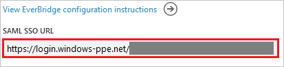

## Prerequisites

To configure Azure AD integration with EverBridge, you need the following items:

- An Azure AD subscription
- An EverBridge single-sign on enabled subscription

> **Note:**
> To test the steps in this tutorial, we do not recommend using a production environment.

To test the steps in this tutorial, you should follow these recommendations:

- Do not use your production environment, unless it is necessary.
- If you don't have an Azure AD trial environment, you can get an one-month trial [here](https://azure.microsoft.com/pricing/free-trial/).

### Configuring EverBridge for single sign-on

1. To get SSO configured for your application, you need to sign-on to your Everbridge tenant as an administrator.

2. In the menu on the top, click the **Settings** tab and select **Single Sign-On** under **Security**.
   
    
   
    a. In the **Name** textbox, type the name of Identifier Provider (for example: your company name).
   
    b. In the **API Name** textbox, type the name of API.
   
    C. Click **Choose File** button to upload the **[Downloaded SAML Metadata file](%metadata:metadataDownloadUrl%)** in **Step 4**.
   
    d. As **SAML Identity Location**, select "Identity is in the NameIdentifier element of the Subject statement".
   
    e. Paste the **Azure AD Single Sign-On Service URL** : %metadata:singleSignOnServiceUrl% from Azure AD into the **Identity Provider Login URL** in Everbridge.
   
    
   
    f. As **Service Provider Initiated Request Binding**, select HTTP Redirect.

	g. Click **Save**
 
## Quick Reference

* **Azure AD Single Sign-On Service URL** : %metadata:singleSignOnServiceUrl%

* **[Download SAML Metadata file](%metadata:metadataDownloadUrl%)**

## Additional Resources

* [How to integrate EverBridge with Azure Active Directory](https://docs.microsoft.com/azure/active-directory/active-directory-saas-everbridge-tutorial)
