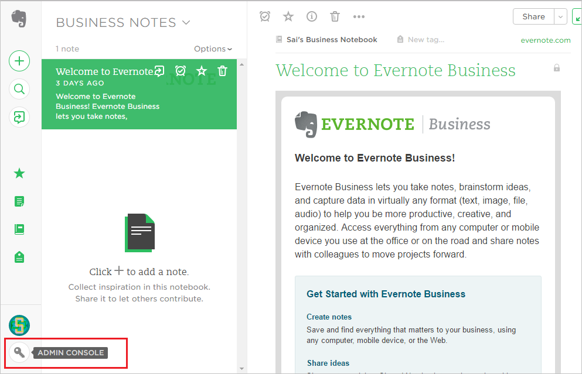
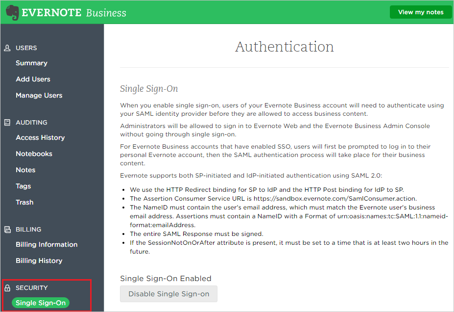
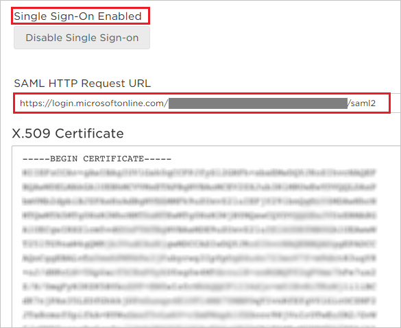

## Prerequisites

To configure Azure AD integration with Evernote, you need the following items:

- An Azure AD subscription
- An Evernote single-sign on enabled subscription

> **Note:**
> To test the steps in this tutorial, we do not recommend using a production environment.

To test the steps in this tutorial, you should follow these recommendations:

- Do not use your production environment, unless it is necessary.
- If you don't have an Azure AD trial environment, you can get a one-month trial [here](https://azure.microsoft.com/pricing/free-trial/).

### Configuring Evernote for single sign-on

1. In a different web browser window, log in to your Evernote company site as an administrator.

2. Go to **'Admin Console'**

	

3. From the **'Admin Console'**, go to **‘Security’** and select **‘Single Sign-On’**

	

4. Configure the following values:

	a.  **Enable SSO:** SSO is enabled by default (Click **Disable Single Sign-on** to remove the SSO requirement)

	b. **SAML HTTP Request URL** - Enter **Azure AD Single Sign-On Service URL**: %metadata:singleSignOnServiceUrl% from the **Configure Evernote** section on Azure AD

	c. **X.509 Certificate** - Open the downloaded certificate from Azure AD in a notepad and copy the content including "BEGIN CERTIFICATE" and "END CERTIFICATE"

	

	d.Click **Save Changes** 

## Quick Reference

* **Azure AD Single Sign-On Service URL**: %metadata:singleSignOnServiceUrl%

* **[Download Azure AD Signing Certificate (Base64 encoded)](%metadata:certificateDownloadBase64Url%)**

## Additional Resources

* [How to integrate Evernote with Azure Active Directory](active-directory-saas-evernote-tutorial.md)

