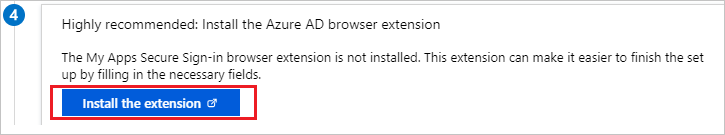
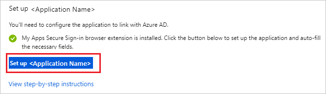
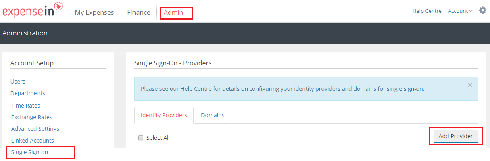
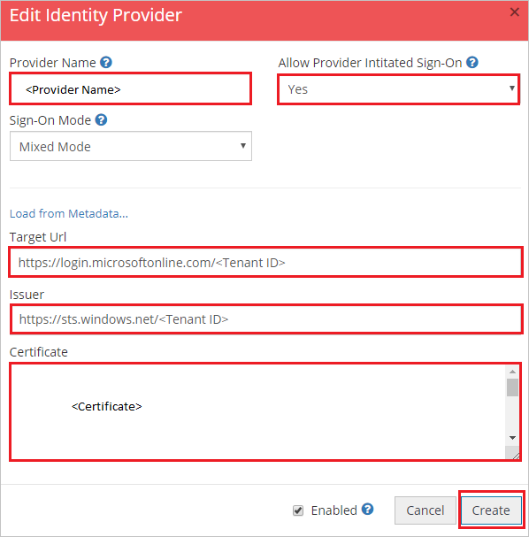

## Prerequisites

To configure Azure AD integration with ExpenseIn, you need the following items:

- An Azure AD subscription
- An ExpenseIn single sign-on enabled subscription

> **Note:**
> To test the steps in this tutorial, we do not recommend using a production environment.

To test the steps in this tutorial, you should follow these recommendations:

- Do not use your production environment, unless it is necessary.
- If you don't have an Azure AD trial environment, you can get a [free account](https://azure.microsoft.com/free/).

### Configuring ExpenseIn for single sign-on

1. To automate the configuration within ExpenseIn, you need to install **My Apps Secure Sign-in browser extension** by clicking **Install the extension**.

	

2. After adding extension to the browser, click on **Setup ExpenseIn** will direct you to the ExpenseIn application. From there, provide the admin credentials to sign into ExpenseIn. The browser extension will automatically configure the application for you and automate steps 3-5.

	

3. If you want to setup ExpenseIn manually, open a new web browser window and sign into your ExpenseIn company site as an administrator and perform the following steps:

4. Click on **Admin** on the top of the page then navigate to **Single Sign-On** and click **Add provider**.

	 

5. On the **New Identity Provider** pop-up, Perform the following steps:

    

	a. In the **Provider Name** text box, type the name like ex:Azure.

	b. Select **Yes** as **Allow Provider Intitated Sign-On**.

	c. In the **Target Url** text box, paste the value of **Login URL** : %metadata:singleSignOnServiceUrl%, which you have copied from Azure portal.

    d. In the **Issuer** text box, paste the value of **Azure AD Identifier**, which you have copied from Azure portal.

    e. Open the **[Downloaded Azure AD Signing Certifcate](%metadata:CertificateDownloadRawUrl%)** in Notepad, copy its content and paste it in the **Certificate** text box.

	f. Click **Create**.

## Quick Reference

* **Login URL** : %metadata:singleSignOnServiceUrl%

* **[Download Azure AD Signing Certifcate](%metadata:CertificateDownloadRawUrl%)**

* **[Download SAML Metadata file](%metadata:metadataDownloadUrl%)**

## Additional Resources

* [How to integrate ExpenseIn with Azure Active Directory](https://docs.microsoft.com/azure/active-directory/saas-apps/expensein-tutorial)
