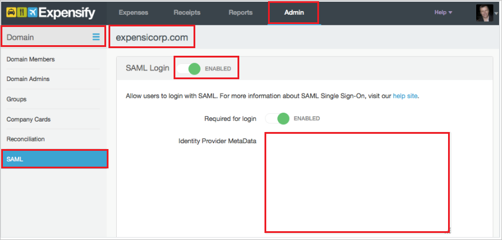

## Prerequisites

To configure Azure AD integration with Expensify, you need the following items:

- An Azure AD subscription
- A Expensify single sign-on enabled subscription

> **Note:**
> To test the steps in this tutorial, we do not recommend using a production environment.

To test the steps in this tutorial, you should follow these recommendations:

- Do not use your production environment, unless it is necessary.
- If you don't have an Azure AD trial environment, you can get a one-month trial [here](https://azure.microsoft.com/pricing/free-trial/).

### Configuring Expensify for single sign-on

6. To enable SSO in Expensify, you first need to enable **Domain Control** in the application. You can enable Domain Control in the application through the steps listed [here](http://help.expensify.com/domain-control). For additional support, work with [Expensify Client support team](mailto:help@expensify.com). Once you have Domain Control enabled, follow these steps:
   
    
	
	a. Sign on to your Expensify application.
	
	b. In the toolbar on the top, click **Admin**.
	
	c. In the left panel, click **Domain**.
	
	d. Click your verified domain name.
	
	e. In the left panel, click **SAML**, and then select **Enabled**.
	
	f. Open the downloaded [Federation Metadata](%metadata:metadataDownloadUrl%) from Azure AD in notepad, copy the content, and then paste it into the **Identity Provider Metadata** textbox.

## Quick Reference

* **Azure AD Single Sign-On Service URL** : %metadata:singleSignOnServiceUrl%

* **Azure AD Sign Out URL** : %metadata:singleSignOutServiceUrl%

* **Azure AD SAML Entity ID** : %metadata:IssuerUri%

* **[Download SAML Metadata file](%metadata:metadataDownloadUrl%)**

## Additional Resources

* [How to integrate Expensify with Azure Active Directory](https://docs.microsoft.com/azure/active-directory/active-directory-saas-expensify-tutorial)
