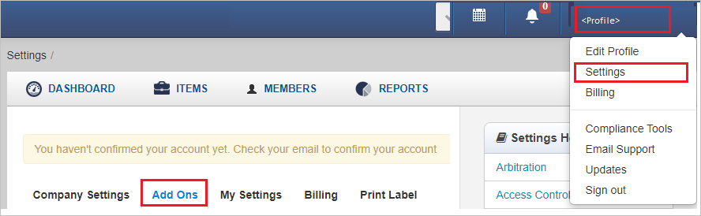
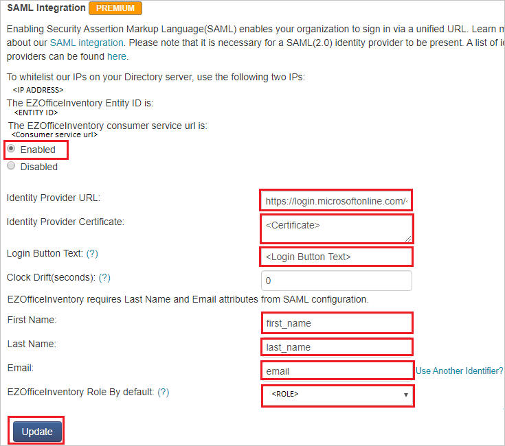

## Prerequisites

To configure Azure AD integration with EZOfficeInventory, you need the following items:

- An Azure AD subscription
- An EZOfficeInventory single sign-on enabled subscription

> **Note:**
> To test the steps in this tutorial, we do not recommend using a production environment.

To test the steps in this tutorial, you should follow these recommendations:

- Do not use your production environment, unless it is necessary.
- If you don't have an Azure AD trial environment, you can get a [free account](https://azure.microsoft.com/free/).

### Configuring EZOfficeInventory for single sign-on

1. Open a new web browser window and sign into your EZOfficeInventory company site as an administrator.

2. On the top-right corner of the page, click on **Profile** and then navigate to **Settings** > **Add Ons**.

    

3. Scroll down up to the **SAML Integration** section, perform the following steps:

	

	a. Check the **Enabled** option.

	b. In the **Identity Provider URL** text box, Paste the **Login URL** : %metadata:singleSignOnServiceUrl% value, which you have copied from the Azure portal.

	c. Open the Base64 encoded certificate in notepad, copy its content and paste it into the **Identity Provider Certificate** text box.

	d. In **Login Button Text** text box, enter the text of login button.

	e. In **First Name** text box, enter **first_name**.

	f. In **Last Name** text box, enter **last_name**.

	g. In **Email** text box, enter **email**.

	h. Select your role as per your requirement from the **EZOfficeInventory Role By default** option.

	i. Click **Update**.

## Quick Reference

* **Login URL** : %metadata:singleSignOnServiceUrl%

* **[Download Azure AD Signing Certifcate](%metadata:CertificateDownloadRawUrl%)**

* **[Download SAML Metadata file](%metadata:metadataDownloadUrl%)**

## Additional Resources

* [How to integrate EZOfficeInventory with Azure Active Directory](https://docs.microsoft.com/azure/active-directory/saas-apps/ezofficeinventory-tutorial)
