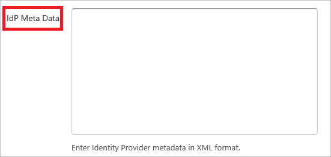

## Prerequisites

To configure Azure AD integration with FileCloud, you need the following items:

- An Azure AD subscription
- A FileCloud single sign-on enabled subscription

> **Note:**
> To test the steps in this tutorial, we do not recommend using a production environment.

To test the steps in this tutorial, you should follow these recommendations:

- Do not use your production environment, unless it is necessary.
- If you don't have an Azure AD trial environment, you can get a one-month trial [here](https://azure.microsoft.com/pricing/free-trial/).

### Configuring FileCloud for single sign-on

1. In a different web browser window, sign-on to your FileCloud tenant as an administrator.

2. On the left navigation pane, click **Settings**. 
   
    

3. Click **SSO** tab on Settings section. 
   
    

4. Select **SAML** as **Default SSO Type** on **Single Sign On (SSO) Settings** panel.
   
    

5. In the **IdP End Point URL** textbox, enter Azure AD SAML Entity ID** : %metadata:IssuerUri%.

    

6. Open your downloaded [metadata file](%metadata:metadataDownloadUrl%) in notepad, copy the content of it into your clipboard, and then paste it to the **IdP Meta Data** textbox on **SAML Settings** panel.

	

7. Click **Save** button.

## Quick Reference

* **Azure AD SAML Entity ID** : %metadata:IssuerUri%

* **[Download Azure AD Signing Certifcate](%metadata:CertificateDownloadRawUrl%)**

* **[Download SAML Metadata file](%metadata:metadataDownloadUrl%)**

## Additional Resources

* [How to integrate FileCloud with Azure Active Directory](https://docs.microsoft.com/azure/active-directory/active-directory-saas-filecloud-tutorial)
