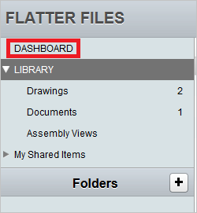
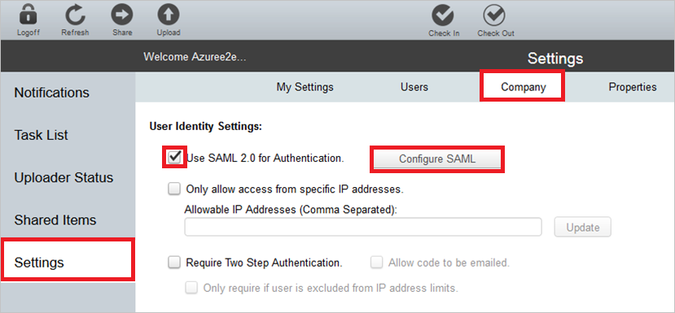
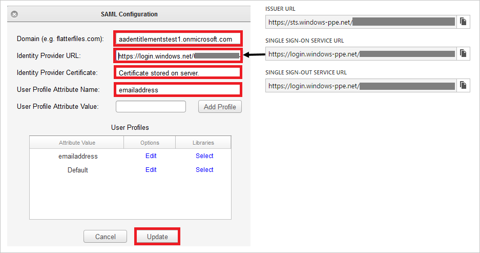

## Prerequisites

To configure Azure AD integration with Flatter Files, you need the following items:

- An Azure AD subscription
- A Flatter Files single sign-on enabled subscription

> **Note:**
> To test the steps in this tutorial, we do not recommend using a production environment.

To test the steps in this tutorial, you should follow these recommendations:

- Do not use your production environment, unless it is necessary.
- If you don't have an Azure AD trial environment, you can get a one-month trial [here](https://azure.microsoft.com/pricing/free-trial/).

### Configuring Flatter Files for single sign-on

1. Sign-on to your Flatter Files application as an administrator.

2. Click **DASHBOARD**. 
   
      

3. Click **Settings**, and then perform the following steps on the **Company** tab: 
   
      
    
	a. Select **Use SAML 2.0 for Authentication**.
    
	b. Click **Configure SAML**.

4. On the **SAML Configuration** dialog, perform the following steps: 
   
      
   
    a. In the **Domain** textbox, type your registered domain.
   
    > **Note:**
    > If you don't have a registered domain yet, contact your Flatter Files support team via [support@flatterfiles.com](mailto:support@flatterfiles.com). 
    
    b. In **Identity Provider URL** textbox, enter **Azure AD Single Sign-On Service URL** : %metadata:singleSignOnServiceUrl%.
   
    c.  Open your [base-64 encoded certificate](%metadata:CertificateDownloadRawUrl%) in notepad, copy the content of it into your clipboard, and then paste it to the **Identity Provider Certificate** textbox.

    d. Click **Update**.

## Quick Reference

* **Azure AD Single Sign-On Service URL** : %metadata:singleSignOnServiceUrl%

* **[Download Azure AD Signing Certifcate](%metadata:CertificateDownloadRawUrl%)**

## Additional Resources

* [How to integrate Flatter Files with Azure Active Directory](https://docs.microsoft.com/azure/active-directory/active-directory-saas-flatterfiles-tutorial)
