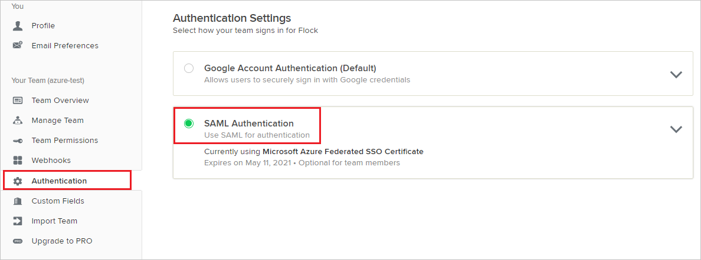
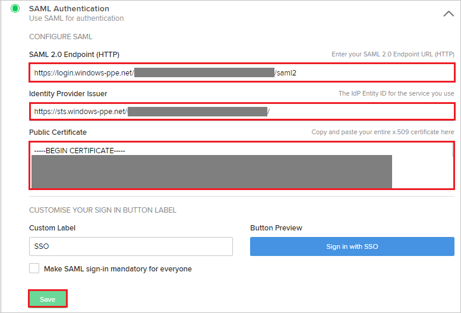

## Prerequisites

To configure Azure AD integration with Flock, you need the following items:

- An Azure AD subscription
- A Flock single sign-on enabled subscription

> **Note:**
> To test the steps in this tutorial, we do not recommend using a production environment.

To test the steps in this tutorial, you should follow these recommendations:

- Do not use your production environment, unless it is necessary.
- If you don't have an Azure AD trial environment, you can [get a one-month trial](https://azure.microsoft.com/pricing/free-trial/).

### Configuring Flock for single sign-on

1. In a different web browser window, log in to your Flock company site as an administrator.

2. Select **Authentication** tab from the left navigation panel and then select **SAML Authentication**.

	

3. In the **SAML Authentication** section, perform the following steps:

	

	a. In the **SAML 2.0 Endpoint(HTTP)** textbox, paste **Azure AD Single Sign-On Service URL** : %metadata:singleSignOnServiceUrl% value which you have copied from the Azure portal.

	b. In the **Identity Provider Issuer** textbox, paste **Azure AD SAML Entity ID** : %metadata:IssuerUri% value which you have copied from the Azure portal.

	c. Open the **[Downloaded Azure AD Signing Certifcate (Base64 encoded)](%metadata:certificateDownloadBase64Url%)** from Azure portal in notepad, paste the content into the **Public Certificate** textbox.

	d. Click **Save**.

## Quick Reference

* **Azure AD Single Sign-On Service URL** : %metadata:singleSignOnServiceUrl%

* **Azure AD SAML Entity ID** : %metadata:IssuerUri%

* **[Download Azure AD Signing Certifcate (Base64 encoded)](%metadata:certificateDownloadBase64Url%)**

## Additional Resources

* [How to integrate Flock with Azure Active Directory](https://docs.microsoft.com/azure/active-directory/active-directory-saas-flock-tutorial)
