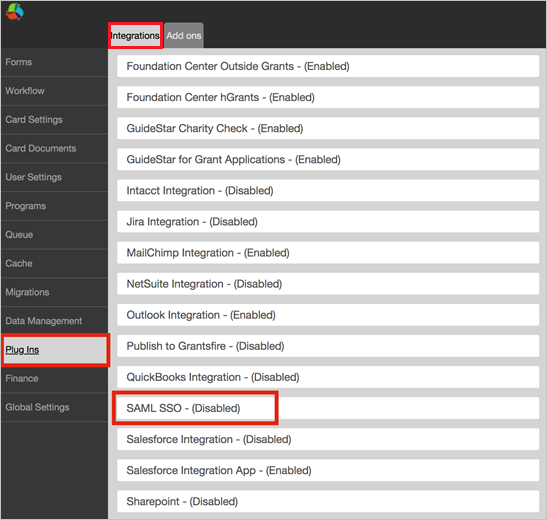
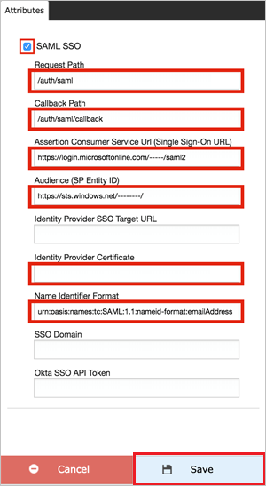

## Prerequisites

To configure Azure AD integration with Fluxx Labs, you need the following items:

- An Azure AD subscription
- A Fluxx Labs single sign-on enabled subscription

> **Note:**
> To test the steps in this tutorial, we do not recommend using a production environment.

To test the steps in this tutorial, you should follow these recommendations:

- Do not use your production environment, unless it is necessary.
- If you don't have an Azure AD trial environment, you can [get a one-month trial](https://azure.microsoft.com/pricing/free-trial/).

### Configuring Fluxx Labs for single sign-on

1. In a different web browser window, sign on to your Fluxx Labs company site as administrator.

2. Select **Admin** below the **Settings** section.

	

3. In the Admin Panel, Select **Plug-ins** > **Integrations** and then select **SAML SSO-(Disabled)**

	
	
4. In the attribute section, perform the following steps:
	
	

	a. Select the **SAML SSO** checkbox.

	b. In the **Request Path** textbox, type **/auth/saml**.

	c. In the **Callback Path** textbox, type **/auth/saml/callback**.

	d. In the **Assertion Consumer Service Url(Single Sign-On URL)** textbox, paste the value of **Azure AD Single Sign-On Service URL** : %metadata:singleSignOnServiceUrl%, which you have copied from the Azure portal.

	e. In the **Audience(SP Entity ID)** textbox, paste the value of **Azure AD SAML Entity ID** : %metadata:IssuerUri%, which you have copied from the Azure portal.

	f. Open your **[Downloaded Azure AD Signing Certifcate (Base64 encoded)](%metadata:certificateDownloadBase64Url%)** encoded certificate in notepad, copy the content of it into your clipboard, and then paste it to the **Identity Provider Certificate** textbox.

	g. In **Name identifier Format** textbox, enter the value `urn:oasis:names:tc:SAML:1.1:nameid-format:emailAddress`.

	h. Click **Save**.

	> [!NOTE]
	> Once the content saved, the field will appear blank for security, but the value has been saved in the configuration.

## Quick Reference

* **Azure AD Single Sign-On Service URL** : %metadata:singleSignOnServiceUrl%

* **Azure AD SAML Entity ID** : %metadata:IssuerUri%

* **[Download Azure AD Signing Certifcate (Base64 encoded)](%metadata:certificateDownloadBase64Url%)**

## Additional Resources

* [How to integrate Fluxx Labs with Azure Active Directory](https://docs.microsoft.com/azure/active-directory/active-directory-saas-fluxxlabs-tutorial)
