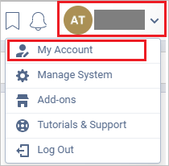
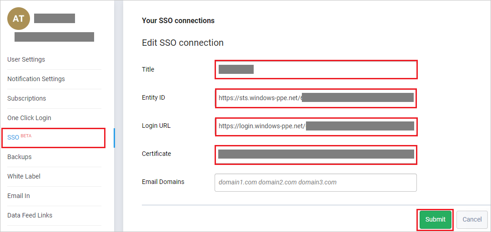

## Prerequisites

To configure Azure AD integration with Freedcamp, you need the following items:

- An Azure AD subscription
- A Freedcamp single sign-on enabled subscription

> **Note:**
> To test the steps in this tutorial, we do not recommend using a production environment.

To test the steps in this tutorial, you should follow these recommendations:

- Do not use your production environment, unless it is necessary.
- If you don't have an Azure AD trial environment, you can you can get a [free account](https://azure.microsoft.com/free/).

### Configuring Freedcamp for single sign-on

1. In a different web browser window, sign in to Freedcamp as a Security Administrator.

2. On the top-right corner of the page, click on **profile** and then navigate to **My Account**.

	

3. From the left side of the menu bar, click on **SSO** and on the **Your SSO connections** page perform the following steps:

	

	a. In the **Title** text box, type the title.

	b. In the **Entity ID** text box, Paste the **Azure AD Identifier** : %metadata:IssuerUri% value, which you have copied from the Azure portal.

	c. In the **Login URL** text box, Paste the **Azure AD Login URL** : %metadata:singleSignOnServiceUrl% value, which you have copied from the Azure portal.

	d. Open the **[Downloaded Azure AD Signing Certifcate (Base64 encoded)](%metadata:certificateDownloadBase64Url%)** in notepad, copy its content and paste it into the **Certificate** text box.

	e. Click **Submit**.

## Quick Reference

* **Azure AD Login URL** : %metadata:singleSignOnServiceUrl%

* **Azure AD Logout URL** : %metadata:singleSignOutServiceUrl%

* **Azure AD Identifier** : %metadata:IssuerUri%

* **[Download Azure AD Signing Certifcate (Base64 encoded)](%metadata:certificateDownloadBase64Url%)**

## Additional Resources

* [How to integrate Freedcamp with Azure Active Directory](https://docs.microsoft.com/azure/active-directory/saas-apps/freedcamp-tutorial)
