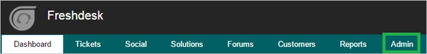
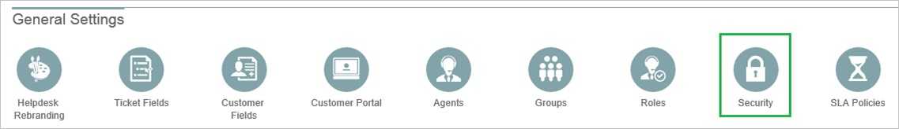
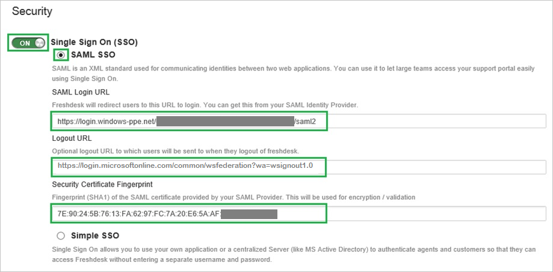

## Prerequisites

To configure Azure AD integration with Freshdesk, you need the following items:

- An Azure AD subscription
- A Freshdesk single-sign on enabled subscription

> **Note:**
> To test the steps in this tutorial, we do not recommend using a production environment.

To test the steps in this tutorial, you should follow these recommendations:

- Do not use your production environment, unless it is necessary.
- If you don't have an Azure AD trial environment, you can get a one-month trial [here](https://azure.microsoft.com/pricing/free-trial/).

### Configuring Freshdesk for single sign-on

1. In a different web browser window, log into your Freshdesk company site as an administrator.

2. In the menu on the top, click **Admin**.
   
   	

3. In the **General Settings** tab, click **Security**.
   
   	

4. In the **Security** section, perform the following steps:
   
	
   
	a. For **Single Sign On (SSO)**, select **On**.

	b. Select **SAML SSO**.

    c. Type the **Azure AD Single Sign-On Service URL** : %metadata:singleSignOnServiceUrl% in the **SAML Login URL** textbox.

    d. Type the **Azure AD Sign Out URL** : %metadata:singleSignOutServiceUrl% in the **Logout URL** textbox.

    e. Copy the **Thumbprint** value from the  **[Downloaded Certificate](%metadata:CertificateDownloadRawUrl%)** and paste it into the **Security Certificate Fingerprint** textbox.  
 
    >[!TIP]
    >For more details, see [How to retrieve a certificate's thumbprint value](http://youtu.be/YKQF266SAxI). 
    
	f. Click **Save**.

## Quick Reference

* **Azure AD Single Sign-On Service URL** : %metadata:singleSignOnServiceUrl%

* **Azure AD Sign Out URL** : %metadata:singleSignOutServiceUrl%

* **[Download Azure AD Signing Certificate](%metadata:CertificateDownloadRawUrl%)**

## Additional Resources

* [How to integrate Freshdesk with Azure Active Directory](active-directory-saas-freshdesk-tutorial.md)

