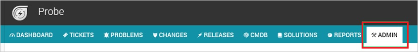
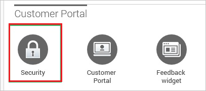
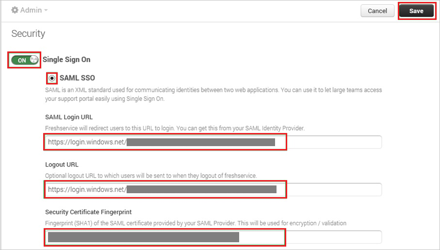

## Prerequisites

To configure Azure AD integration with Freshservice, you need the following items:

- An Azure AD subscription
- A Freshservice single sign-on enabled subscription

> **Note:**
> To test the steps in this tutorial, we do not recommend using a production environment.

To test the steps in this tutorial, you should follow these recommendations:

- Do not use your production environment, unless it is necessary.
- If you don't have an Azure AD trial environment, you can get a one-month trial [here](https://azure.microsoft.com/pricing/free-trial/).

### Configuring Freshservice for single sign-on

1. In a different web browser window, log in to your Freshservice company site as an administrator.

2. In the menu on the top, click **Admin**.
   
    

3. In the **Customer Portal**, click **Security**.
   
    

4. In the **Security** section, perform the following steps:
   
    
   
    a. Switch **Single Sign On**.

    b. Select **SAML SSO**.

    c. In the **SAML Login URL** textbox, paste the value of **Azure AD Single Sign-On Service URL** : %metadata:singleSignOnServiceUrl% which you have copied from Azure portal.

    d. In the **Logout URL** textbox, paste the value of **Azure AD Sign Out URL** : %metadata:singleSignOutServiceUrl% which you have copied from Azure portal.

    e. In **Security Certificate Fingerprint** textbox, paste the **THUMBPRINT** value of certificate which you have copied from Azure portal.

	f. Click **Save**

## Quick Reference

* **Azure AD Single Sign-On Service URL** : %metadata:singleSignOnServiceUrl%

* **Azure AD Sign Out URL** : %metadata:singleSignOutServiceUrl%

* **[Download Azure AD Signing Certifcate](%metadata:CertificateDownloadRawUrl%)**

## Additional Resources

* [How to integrate Freshservice with Azure Active Directory](https://docs.microsoft.com/azure/active-directory/active-directory-saas-freshservice-tutorial)
