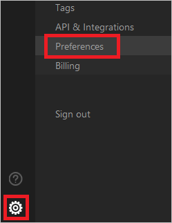
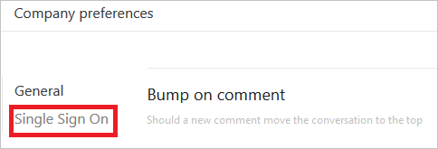
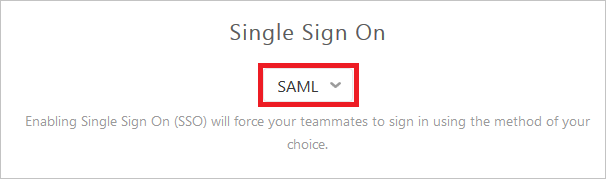
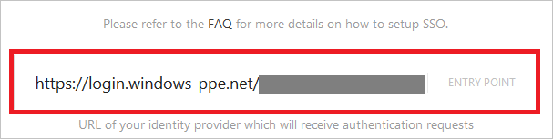
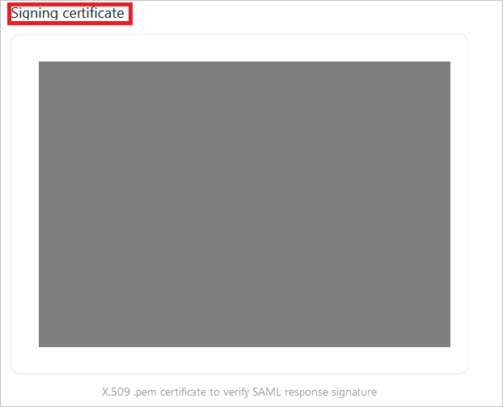
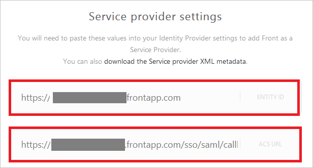

## Prerequisites

To configure Azure AD integration with Front, you need the following items:

- An Azure AD subscription
- A Front single sign-on enabled subscription

> **Note:**
> To test the steps in this tutorial, we do not recommend using a production environment.

To test the steps in this tutorial, you should follow these recommendations:

- Do not use your production environment, unless it is necessary.
- If you don't have an Azure AD trial environment, you can [get a one-month trial](https://azure.microsoft.com/pricing/free-trial/).

### Configuring Front for single sign-on

1. Sign-on to your Front tenant as an administrator.

2. Go to **Settings (cog icon at the bottom of the left sidebar) > Preferences**.
   
    

3. Click **Single Sign On** link.
   
    

4. Select **SAML** in the drop-down list of **Single Sign On**.
   
    

5. In the **Entry Point** textbox put the value of **Azure AD Single Sign-On Service URL** : %metadata:singleSignOnServiceUrl% from Azure AD application configuration wizard.
    
    

6. Open your **[Download Azure AD Signing Certifcate (Base64 encoded)](%metadata:certificateDownloadBase64Url%)** file in notepad, copy the content of it into your clipboard, and then paste it to the **Signing certificate** textbox.
    
    

7. On the **Service provider settings** section, perform the following steps:

	

	a. Copy the value of **Entity ID** and paste it into the **Identifier** textbox in **Front Domain and URLs** section in Azure portal.

	b. Copy the value of **ACS URL** and paste it into the **Sign-on URL** textbox in **Front Domain and URLs** section in Azure portal.
	
8. Click **Save** button.

## Quick Reference

* **Azure AD Single Sign-On Service URL** : %metadata:singleSignOnServiceUrl%

* **[Download Azure AD Signing Certifcate (Base64 encoded)](%metadata:certificateDownloadBase64Url%)**

## Additional Resources

* [How to integrate Front with Azure Active Directory](https://docs.microsoft.com/azure/active-directory/active-directory-saas-front-tutorial)
