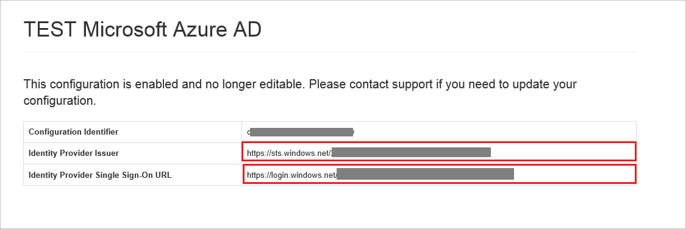

## Prerequisites

To configure Azure AD integration with GaggleAMP, you need the following items:

- An Azure AD subscription
- A GaggleAMP single sign-on enabled subscription

> **Note:**
> To test the steps in this tutorial, we do not recommend using a production environment.

To test the steps in this tutorial, you should follow these recommendations:

- Do not use your production environment, unless it is necessary.
- If you don't have an Azure AD trial environment, you can get a one-month trial [here](https://azure.microsoft.com/pricing/free-trial/).

### Configuring GaggleAMP for single sign-on

1. In another browser instance, navigate to the SAML SSO page created for you by the Gaggle support team (for example: *https://accounts.gaggleamp.com/saml_configurations/oXH8sQcP79dOzgFPqrMTyw/edit*).

2. On your **SAML SSO** page, perform the following steps:  
   
     
 
    a. In the **Identity Provider Issuer** textbox, paste the value of **Azure AD SAML Entity ID** : %metadata:IssuerUri% which you have copied from Azure portal. 
 
    b. In the **Identity Provider Single Sign-On URL** textbox, paste the  value of **Azure AD Single Sign-On Service URL** : %metadata:singleSignOnServiceUrl% which you have copied from Azure portal. 

    c. Click **Save**      

    d. Send the **[Downloaded Azure AD Signing Certifcate (Base64 encoded)](%metadata:certificateDownloadBase64Url%)** certificate to your [GaggleAMP support team](mailto:sales@gaggleamp.com).

## Quick Reference

* **Azure AD Single Sign-On Service URL** : %metadata:singleSignOnServiceUrl%

* **Azure AD Sign Out URL** : %metadata:singleSignOutServiceUrl%

* **Azure AD SAML Entity ID** : %metadata:IssuerUri%

* **[Download Azure AD Signing Certifcate (Base64 encoded)](%metadata:certificateDownloadBase64Url%)**

## Additional Resources

* [How to integrate GaggleAMP with Azure Active Directory](https://docs.microsoft.com/azure/active-directory/active-directory-saas-gaggleamp-tutorial)
