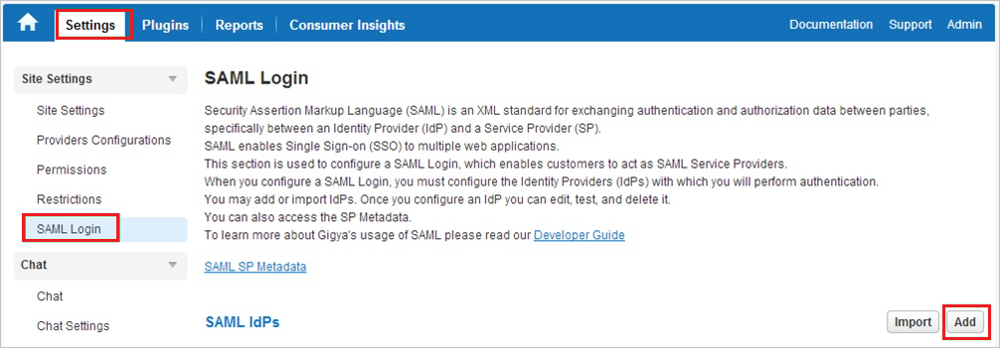
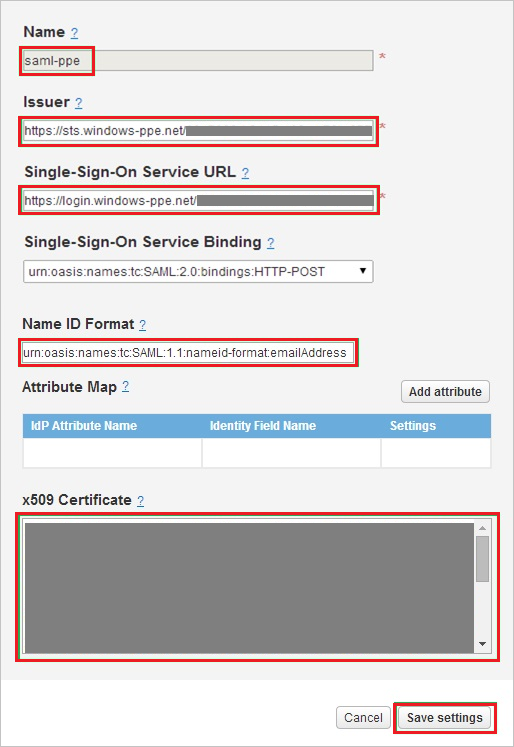

## Prerequisites

To configure Azure AD integration with Gigya, you need the following items:

- An Azure AD subscription
- A Gigya single sign-on enabled subscription

> **Note:**
> To test the steps in this tutorial, we do not recommend using a production environment.

To test the steps in this tutorial, you should follow these recommendations:

- Do not use your production environment, unless it is necessary.
- If you don't have an Azure AD trial environment, you can get a one-month trial [here](https://azure.microsoft.com/pricing/free-trial/).

### Configuring Gigya for single sign-on

1. In a different web browser window, log into your Gigya company site as an administrator.

2. Go to **Settings \> SAML Login**, and then click the **Add** button.
   
    

3. In the **SAML Login** section, perform the following steps:
   
    
   
    a. In the **Name** textbox, type a name for your configuration.
   
    b. In **Issuer** textbox, paste the value of **Azure AD SAML Entity ID** : %metadata:IssuerUri% which you have copied from Azure portal. 
   
    c. In **Single Sign-On Service URL** textbox, paste the value of **Azure AD Single Sign-On Service URL** : %metadata:singleSignOnServiceUrl% which you have copied from Azure portal.
   
    d. In **Name ID Format** textbox, paste the value of **Name Identifier Format** which you have copied from Azure portal.
   
    e. Open your **[Downloaded Azure AD Signing Certificate (Base64 encoded)](%metadata:certificateDownloadBase64Url%)**
 in notepad, copy the content of it into your clipboard, and then paste it to the **X.509 Certificate** textbox.
   
    f. Click **Save Settings**.

## Quick Reference

* **Azure AD Single Sign-On Service URL** : %metadata:singleSignOnServiceUrl%

* **Azure AD SAML Entity ID** : %metadata:IssuerUri%

* **[Download Azure AD Signing Certificate (Base64 encoded)](%metadata:certificateDownloadBase64Url%)**

## Additional Resources

* [How to integrate Gigya with Azure Active Directory](https://docs.microsoft.com/azure/active-directory/active-directory-saas-gigya-tutorial)
