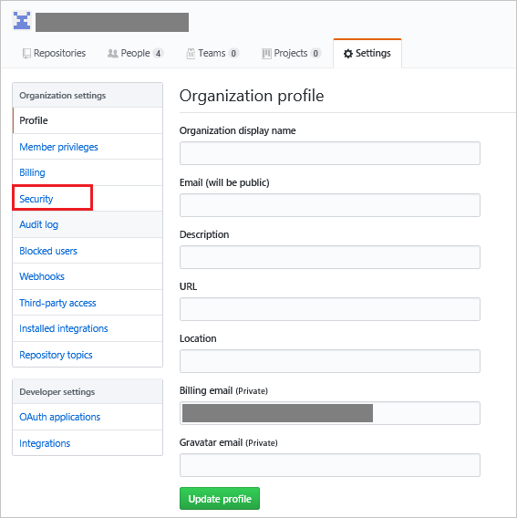
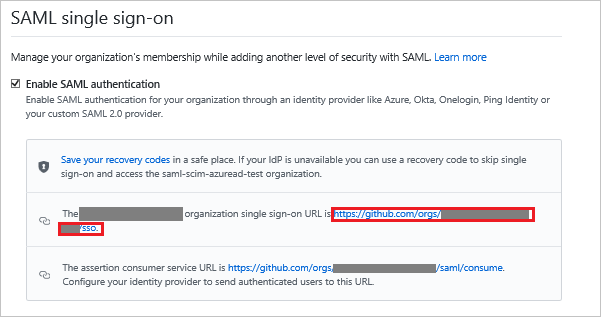
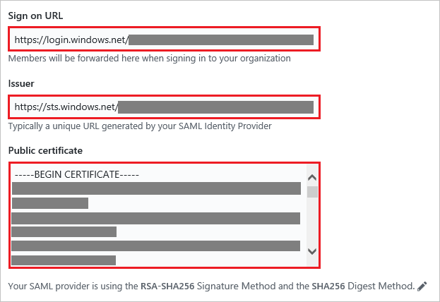

## Prerequisites

To configure Azure AD integration with Github, you need the following items:

- An Azure AD subscription
- A Github single-sign on enabled subscription

> **Note:**
> To test the steps in this tutorial, we do not recommend using a production environment.

To test the steps in this tutorial, you should follow these recommendations:

- Do not use your production environment, unless it is necessary.
- If you don't have an Azure AD trial environment, you can get a one-month trial [here](https://azure.microsoft.com/pricing/free-trial/).

### Configuring Github for single sign-on

1. In a different web browser window, log in to your Github organization site as an administrator.

2. Navigate to **Settings** and click **Security**

	

3. Check the **Enable SAML authentication** box, revealing the Single Sign-on configuration fields. Then, use the single sign-on URL value to update the Single sign-on URL on Azure AD configuration.

	

4. Configure the following fields:

	a. Paste the **Azure AD Single Sign-On Service URL** : %metadata:singleSignOnServiceUrl% value into the **Sign on URL** textbox.

    b. Paste the **Azure AD SAML Entity ID** : %metadata:IssuerUri% value into the **Issuer** textbox. 

    c. **Public Certificate**: Open the **[Downloaded Azure AD Signing Certificate (Base64 encoded)](%metadata:certificateDownloadBase64Url%)** from Azure AD in a notepad and copy the content including "BEGIN CERTIFICATE" and "END CERTIFICATE"

	

5. Click on **Test SAML configuration** to confirm that no validation failures or errors during SSO.

	

6. Click **Save**

## Quick Reference

* **Azure AD Single Sign-On Service URL** : %metadata:singleSignOnServiceUrl%

* **Azure AD SAML Entity ID** : %metadata:IssuerUri%

* **[Download Azure AD Signing Certificate (Base64 encoded)](%metadata:certificateDownloadBase64Url%)**

## Additional Resources

* [How to integrate Github with Azure Active Directory](active-directory-saas-github-tutorial.md)
