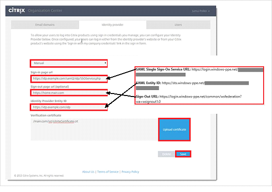

## Prerequisites

To configure Azure AD integration with Citrix GoToMeeting, you need the following items:

- An Azure AD subscription
- A Citrix GoToMeeting single-sign on enabled subscription

> **Note:**
> To test the steps in this tutorial, we do not recommend using a production environment.

To test the steps in this tutorial, you should follow these recommendations:

- Do not use your production environment, unless it is necessary.
- If you don't have an Azure AD trial environment, you can get a one-month trial [here](https://azure.microsoft.com/pricing/free-trial/).

### Configuring Citrix GoToMeeting for single sign-on

1. In a different browser window, log in to your [Citrix Organization Center](https://account.citrixonline.com/organization/administration/).

2. Click the **Identity Provider** tab, and then perform the following steps:  
   
	
   
    a. Select **Manual**

    b. In the Azure portal, on the **Configure single sign-on at Citrix GoToMeeting** dialog page, copy the **Azure AD Single Sign-On Service URL** : %metadata:singleSignOnServiceUrl% value, and then paste it into the **Sign-in page URL** textbox. 

    c. In the Azure portal, on the **Configure single sign-on at Citrix GoToMeeting** dialog page, copy the **Azure AD Sign Out URL** : %metadata:singleSignOutServiceUrl% value, and then paste it into the **Sign-out page URL** textbox.

    d. In the Azure portal, on the **Configure single sign-on at Citrix GoToMeeting** dialog page, copy the **Azure AD SAML Entity ID** : %metadata:IssuerUri% value, and then paste it into the **Identity Provider Entity ID** textbox.

    e. To upload your **[Downloaded Azure AD Signing Certificate (Base64 encoded)](%metadata:certificateDownloadBase64Url%)**, click **Upload Certificate**.

    f. Click **Save**.

## Quick Reference

* **Azure AD Single Sign-On Service URL** : %metadata:singleSignOnServiceUrl%

* **Azure AD Sign Out URL** : %metadata:singleSignOutServiceUrl%

* **Azure AD SAML Entity ID** : %metadata:IssuerUri%

* **[Download Azure AD Signing Certificate (Base64 encoded)](%metadata:certificateDownloadBase64Url%)**

## Additional Resources

* [How to integrate Citrix GoToMeeting with Azure Active Directory](https://docs.microsoft.com/azure/active-directory/active-directory-saas-citrix-gotomeeting-tutorial)
* [How to configure user provisioning with Citrix GoToMeeting](https://docs.microsoft.com/azure/active-directory/active-directory-saas-citrixgotomeeting-provisioning-tutorial)