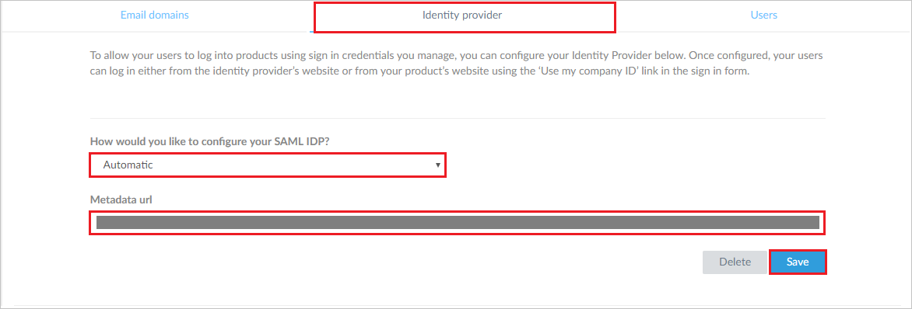
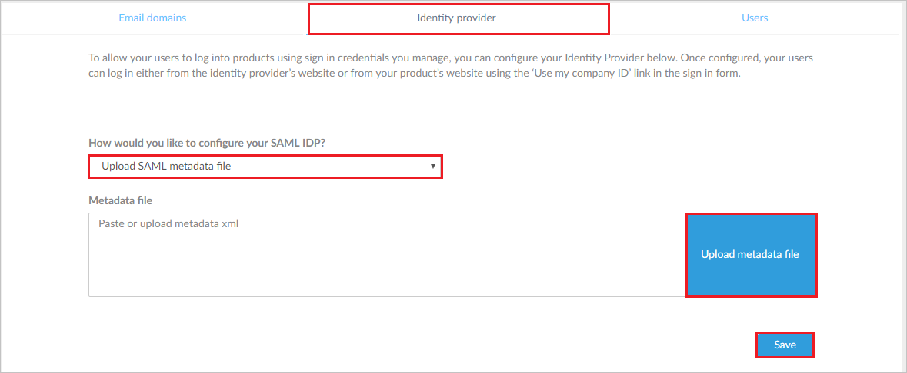
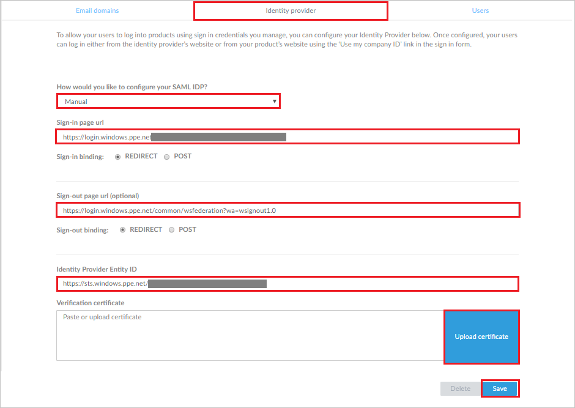

## Prerequisites

To configure Azure AD integration with GoToMeeting, you need the following items:

- An Azure AD subscription
- A GoToMeeting single sign-on enabled subscription

> **Note:**
> To test the steps in this tutorial, we do not recommend using a production environment.

To test the steps in this tutorial, you should follow these recommendations:

- Do not use your production environment, unless it is necessary.
- If you don't have an Azure AD trial environment, you can [get a one-month trial](https://azure.microsoft.com/pricing/free-trial/).

### Configuring GoToMeeting for single sign-on

1. In a different browser window, log in to your [GoToMeeting Organization Center](https://account.citrixonline.com/organization/administration/)

2. Under **identity provider** tab, you can configure the Azure settings either by providing the generated **Metadata URL** or the downloaded **Metadata file** or **Manual**.

3. For **Metadata URL** perform the following steps:

	

	a. In the **How would you like to configure your SAML IDP?**, Select **Automatic** from the dropdown.

	b. Paste the **Metadata URL**, which you have generated in the previous steps into the  **Metadata URL** textbox.

	c. Click **Save**.

4. For **Metadata file** perform the following steps:

	

	a. In the **How would you like to configure your SAML IDP?**, Select **Upload SAML metadata file** from the dropdown.

	b. To upload your downloaded metadata file, click **Upload metadata file**.

	c. Click **Save**.

5. For **Manual** perform the following steps:

	

	a.  In **Sign-in page URL** textbox, paste the value of **Azure AD Single Sign-On Service URL** : %metadata:singleSignOnServiceUrl% which you have copied from Azure portal.

	b.  In **Sign-out page URL** textbox, paste the value of **Azure AD Sign Out URL** : %metadata:singleSignOutServiceUrl% which you have copied from Azure portal.

	c.  In **Identity Provider Entity ID** textbox, paste the value of **Azure AD SAML Entity ID** : %metadata:IssuerUri% which you have copied from Azure portal.

	d. Extract the X509Certificate from the **[Downloaded Azure AD Signing Certifcate (Base64 encoded)](%metadata:certificateDownloadBase64Url%)** and upload this certificate by clicking on **Upload certificate**.

	e. Click **Save**.

## Quick Reference

* **Azure AD Single Sign-On Service URL** : %metadata:singleSignOnServiceUrl%

* **Azure AD Sign Out URL** : %metadata:singleSignOutServiceUrl%

* **Azure AD SAML Entity ID** : %metadata:IssuerUri%

* **[Download Azure AD Signing Certifcate (Base64 encoded)](%metadata:certificateDownloadBase64Url%)**

## Additional Resources

* [How to integrate GoToMeeting with Azure Active Directory](https://docs.microsoft.com/azure/active-directory/active-directory-saas-citrix-gotomeeting-tutorial)
