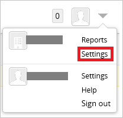
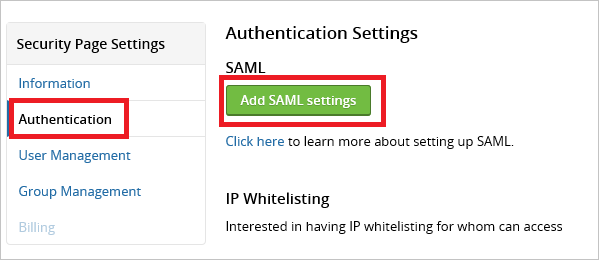
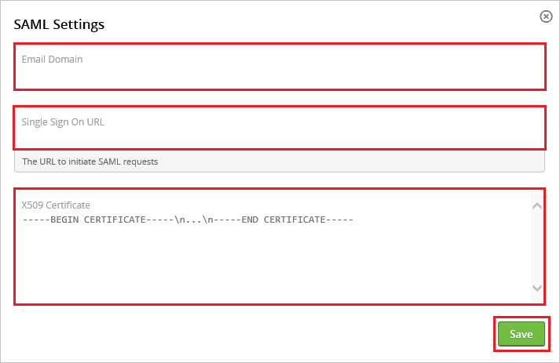
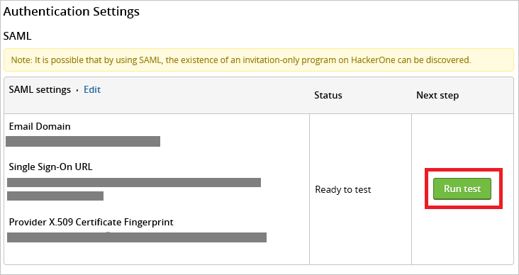

## Prerequisites

To configure Azure AD integration with Hackerone, you need the following items:

- An Azure AD subscription
- A Hackerone single sign-on enabled subscription

> **Note:**
> To test the steps in this tutorial, we do not recommend using a production environment.

To test the steps in this tutorial, you should follow these recommendations:

- Do not use your production environment, unless it is necessary.
- If you don't have an Azure AD trial environment, you can get a one-month trial [here](https://azure.microsoft.com/pricing/free-trial/).

### Configuring Hackerone for single sign-on

1. Sign On to your HackerOne tenant as an administrator.

2. In the menu on the top, click the "**Settings**."
   
     

3. Navigate to "**Authentication**" and click "**Add SAML settings**."
   
     

4. On the **SAML Settings** dialog, perform the following steps:
   
     

    a. In the **Email Domain** textbox, type a registered domain.

    b. In  **Single Sign On URL** textboxes, paste the value of **Azure AD Single Sign-On Service URL** : %metadata:singleSignOnServiceUrl% which you have copied from Azure portal.

	c. Open your **[Downloaded Azure AD Signing Certificate (Base64 encoded)](%metadata:certificateDownloadBase64Url%)** in notepad downloaded from Azure portal, copy the content of it into your clipboard, and then paste it to the **X509 Certificate**  textbox.
    
    d. Click **Save**.

5. On the Authentication Settings dialog, perform the following steps:
   
     

    a. Click **Run test**.

    b. If the value of the **Status** field equals **Last test status: created**, contact your [HackerOne support team](mailto:support@hackerone.com) to request a review of your configuration.

## Quick Reference

* **Azure AD Single Sign-On Service URL** : %metadata:singleSignOnServiceUrl%

* **[Download Azure AD Signing Certificate (Base64 encoded)](%metadata:certificateDownloadBase64Url%)**

## Additional Resources

* [How to integrate Hackerone with Azure Active Directory](https://docs.microsoft.com/azure/active-directory/active-directory-saas-hackerone-tutorial)
