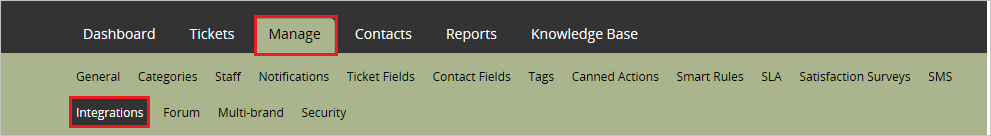
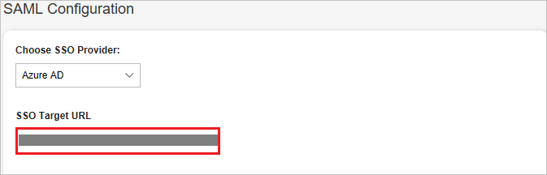

## Prerequisites

To configure Azure AD integration with HappyFox, you need the following items:

- An Azure AD subscription
- A HappyFox single-sign on enabled subscription

> **Note:**
> To test the steps in this tutorial, we do not recommend using a production environment.

To test the steps in this tutorial, you should follow these recommendations:

- Do not use your production environment, unless it is necessary.
- If you don't have an Azure AD trial environment, you can get a one-month trial [here](https://azure.microsoft.com/pricing/free-trial/).

### Configuring HappyFox for single sign-on

1. Sign on to your HappyFox staff portal and navigate to **Manage**, Click on **Integrations** tab.

	 

2. In the Integrations tab, Click **Configure** under **SAML Integration** to open the Single Sign On Settings.

	 

3. Inside SAML configuration section, Paste the **Azure AD Single Sign-On Service URL** : %metadata:singleSignOnServiceUrl% that you have copied from Azure portal into **SSO Target URL** textbox.

	

4. Click **Save Settings** button.

	

## Quick Reference

* **Azure AD Single Sign-On Service URL** : %metadata:singleSignOnServiceUrl%

* **[Download Azure AD Signing Certificate (Base64 encoded)](%metadata:certificateDownloadBase64Url%)**

## Additional Resources

* [How to integrate HappyFox with Azure Active Directory](active-directory-saas-happyfox-tutorial.md)
