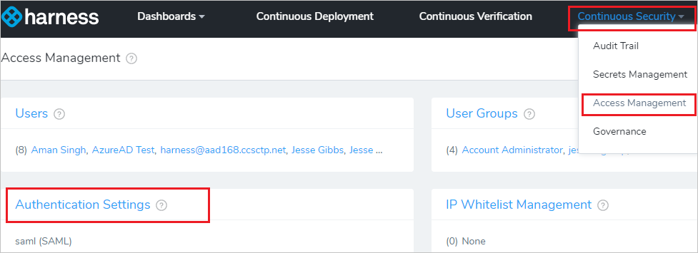
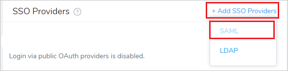
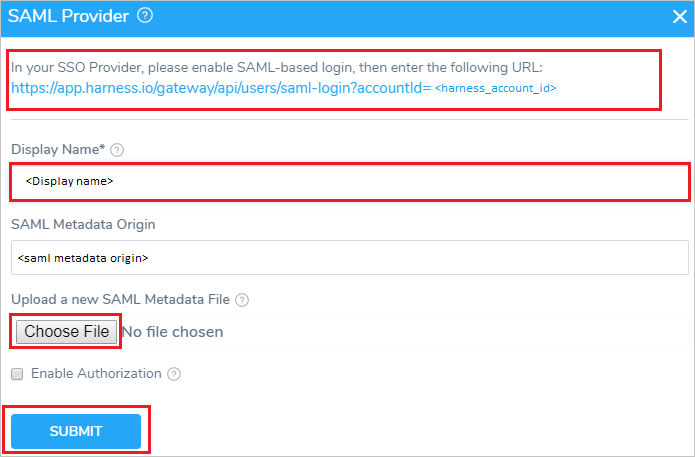

## Prerequisites

To configure Azure AD integration with Harness, you need the following items:

- An Azure AD subscription
- A Harness single sign-on enabled subscription

> **Note:**
> To test the steps in this tutorial, we do not recommend using a production environment.

To test the steps in this tutorial, you should follow these recommendations:

- Do not use your production environment, unless it is necessary.
- If you don't have an Azure AD trial environment, you can get a [free account](https://azure.microsoft.com/free/).

### Configuring Harness for single sign-on

1. Open a new web browser window and sign into your Harness company site as an administrator.

1. On the top-right of the page, click on **Continuous Security** > **Access Management** > **Authentication Settings**.

	

1. On the **SSO Providers** section, click on **+ Add SSO Providers** > **SAML**.

	

1. On the **SAML Provider** pop-up, perform the following steps:

	

    a. Copy the **In your SSO Provider, please enable SAML-based login, then enter the following URL** instance and paste it in Reply URL textbox in **Basic SAML Configuration** section on Azure portal.

	b. In the **Display Name** text box, type your display name.

	c. Click **Choose file** to upload the **[Downloaded SAML Metadata file](%metadata:metadataDownloadUrl%)** from Azure AD.

	d. Click **SUBMIT**.

## Quick Reference

* **Login URL** : %metadata:singleSignOnServiceUrl%

* **[Download SAML Metadata file](%metadata:metadataDownloadUrl%)**

## Additional Resources

* [How to integrate Harness with Azure Active Directory](https://docs.microsoft.com/azure/active-directory/saas-apps/harness-tutorial)
