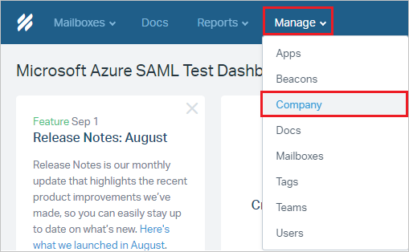
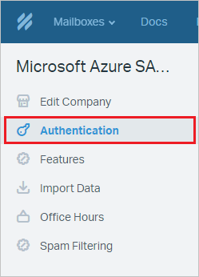
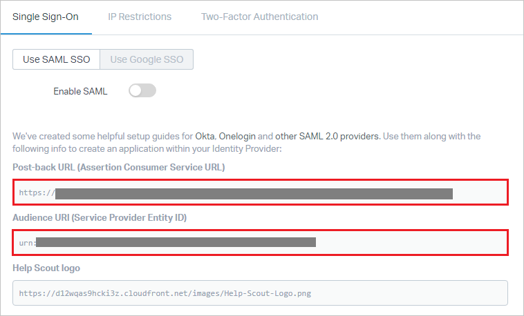
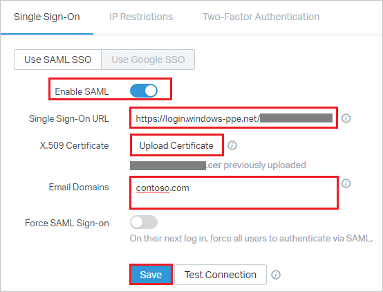

## Prerequisites

To configure Azure AD integration with Help Scout, you need the following items:

- An Azure AD subscription
- A Help Scout single sign-on enabled subscription

To test the steps in this tutorial, you should follow these recommendations:

- Do not use your production environment, unless it is necessary.
- If you don't have an Azure AD trial environment, you can get a one-month trial [here](https://azure.microsoft.com/pricing/free-trial/).

### Configuring Help Scout for single sign-on

1. In a different web browser window, log in to your Help Scout company site as an administrator.

2. Once you are logged in click on **"Manage"** from the top menu and then select **"Company"** from the dropdown menu.

	 
 
3. Select **"Authentication"** from the left-hand menu. 

	 

4. This takes you to the SAML settings section and perform the following steps:

	 
 
	a. Copy the **Post-back URL (Assertion Consumer Service URL)** value and paste the value in the **Reply URL** box in the Azure portal, under Help Scout **Domain and URLs** section.
	
	b. Copy the **Audience URI (Service Provider Entity ID)** value and paste the value in the **Identifier** box in the Azure portal, under Help Scout **Domain and URLs** section.

5. Toggle **Enable SAML** on and perform the following steps:

	 
 
	a. In **Single Sign-On URL** textbox, paste the value of **Azure AD Single Sign-On Service URL** : %metadata:singleSignOnServiceUrl%
	
	b. Click **Upload Certificate** to upload the **[Azure AD Signing Certifcate (Base64 encoded)](%metadata:certificateDownloadBase64Url%)**.

	c. Enter your organization's email domain(s) e.x.- `contoso.com` in the **Email Domains** textbox. You can separate multiple domains with a comma. Anytime a Help Scout User or Administrator who enters that specific domain on the [Help Scout log-in page](https://secure.helpscout.net/members/login/) will be routed to Identity Provider to authenticate with their credentials.

	d. Lastly, you can toggle **Force SAML Sign-on** if you want Users to only log in to Help Scout via through this method. If you'd still like to leave the option for them to sign in with their Help Scout credentials, you can leave it toggled off. Even if this is enabled, an Account Owner will always be able to log in to Help Scout with their account password.

	e. Click **Save**.

## Quick Reference

* **Azure AD Single Sign-On Service URL** : %metadata:singleSignOnServiceUrl%

* **[Download Azure AD Signing Certifcate (Base64 encoded)](%metadata:certificateDownloadBase64Url%)**

## Additional Resources

* [How to integrate Help Scout with Azure Active Directory](https://docs.microsoft.com/azure/active-directory/active-directory-saas-helpscout-tutorial)
