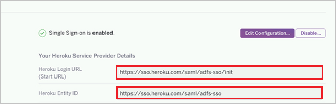

## Prerequisites

To configure Azure AD integration with heroku, you need the following items:

- An Azure AD subscription
- A heroku single sign-on enabled subscription

> **Note:**
> To test the steps in this tutorial, we do not recommend using a production environment.

To test the steps in this tutorial, you should follow these recommendations:

- Do not use your production environment, unless it is necessary.
- If you don't have an Azure AD trial environment, you can get a one-month trial [here](https://azure.microsoft.com/pricing/free-trial/).

### Configuring heroku for single sign-on

1. To enable SSO in Heroku, perform the following steps:
   
    a. Log in to the Heroku account as an administrator.

    b. Click the **Settings** tab.

    c. On the **Single Sign On Page**, click **Upload Metadata**.

    d. Upload the metadata file, which you have downloaded from the Azure portal.

    e. When the setup is successful, administrators see a confirmation dialog and the URL of the SSO Login for end users is displayed. 

	f. Copy the **Heroku Login URL** and **Heroku Entity ID** values and go back to **Heroku Domain and URLs** section in Azure portal and paste these values into the **Sign-On Url** and **Identifier** textboxes respectively.

	 
	
2. Click **Next**.

## Quick Reference

* **[Download Azure AD Signing Certificate](%metadata:CertificateDownloadRawUrl%)**

* **[Download SAML Metadata file](%metadata:metadataDownloadUrl%)**

## Additional Resources

* [How to integrate heroku with Azure Active Directory](https://docs.microsoft.com/azure/active-directory/active-directory-saas-heroku-tutorial)
