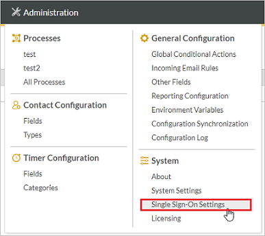

## Prerequisites

To configure Azure AD integration with HighGear, you need the following items:

- An Azure AD subscription
- A HighGear single sign-on enabled subscription

> **Note:**
> To test the steps in this tutorial, we do not recommend using a production environment.

To test the steps in this tutorial, you should follow these recommendations:

- Do not use your production environment, unless it is necessary.
- If you don't have an Azure AD trial environment, you can [get a one-month trial](https://azure.microsoft.com/pricing/free-trial/).

### Configuring HighGear for single sign-on

To configure HighGear for Single Sign-On, please log in to your HighGear system. Once you're logged in, move your mouse over the Administration tab in HighGear and click the Single Sign-On Settings menu item.

1. In the **Identity Provider Name**, type a short description that will appear in HighGear's Single Sign-On button on the Login page. For example: Azure AD

2. In the **Single Sign-On (SSO) URL** field in HighGear, paste the value from the **Login URL** %metadata:singleSignOnServiceUrl% field that is in the **Set up HighGear** section in Azure.

3. In the **Identity Provider Entity ID** field in HighGear, paste the value from the **Azure AD Identifier** field that is in the **Set up HighGear** section in Azure.

4. In the **Single Logout (SLO) URL** field in HighGear, paste the value from the **Logout URL** field that is in the **Set up HighGear** section in Azure.

5. Use Notepad to open the certificate that you downloaded from the **SAML Signing Certificate** section in Azure. You should have **[Downloaded Azure AD Signing Certifcate (Base64 encoded)](%metadata:certificateDownloadBase64Url%)** format. Copy the contents of the certificate from Notepad and paste it into the **Identity Provider Certificate** field in HighGear.

6. Email the [HighGear Support Team](mailto:support@highgear.com) to request your HighGear Certificate. Follow the instructions you receive from them to fill out the **HighGear Certificate** and **HighGear Certificate Password** fields.

7. Click the **Save** button to save your HighGear Single Sign-On configuration.

## Quick Reference

* **Azure AD Single Sign-On Service URL** : %metadata:singleSignOnServiceUrl%

* **[Download Azure AD Signing Certifcate (Base64 encoded)](%metadata:certificateDownloadBase64Url%)**

## Additional Resources

* [How to integrate HighGear with Azure Active Directory](https://docs.microsoft.com/azure/active-directory/saas-apps/highgear-tutorial)
