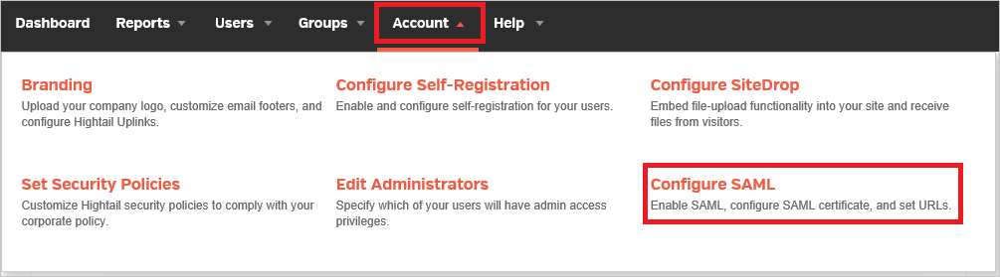
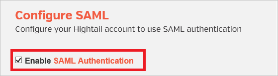
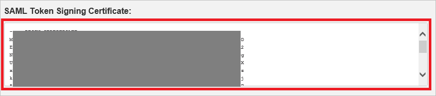
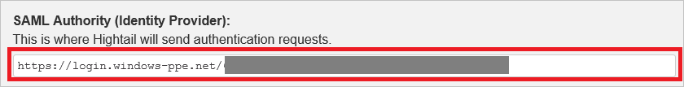
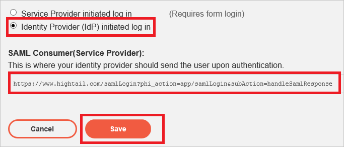

## Prerequisites

To configure Azure AD integration with Hightail, you need the following items:

- An Azure AD subscription
- A Hightail single sign-on enabled subscription

> **Note:**
> To test the steps in this tutorial, we do not recommend using a production environment.

To test the steps in this tutorial, you should follow these recommendations:

- Do not use your production environment, unless it is necessary.
- If you don't have an Azure AD trial environment, you can get a one-month trial [here](https://azure.microsoft.com/pricing/free-trial/).

### Configuring Hightail for single sign-on

1. To get SSO configured for your application, you need to sign-on to your Hightail tenant as an administrator.
   
    a. In the menu on the top, click the **Account** tab and select **Configure SAML**.
 
     

    b. Select the checkbox of **Enable SAML Authentication**.

     

    c. Open your base-64 encoded certificate in notepad downloaded from Azure portal, copy the content of it into your clipboard, and then paste it to the **SAML Token Signing Certificate** textbox.

     

    d. In the **SAML Authority (Identity Provider)** textbox, paste the value of **Azure AD Single Sign-On Service URL** : %metadata:singleSignOnServiceUrl% copied from Azure portal.

    

    e. If you wish to configure the application in **IDP initiated mode** select **"Identity Provider (IdP) initiated log in"**. If **SP initiated mode** select **"Service Provider (SP) initiated log in"**.

    

    f. Copy the SAML consumer URL for your instance and paste it in **Reply URL** textbox in **Hightail Domain and URLs** section on Azure portal.
    
    g. Click **Save**.

## Quick Reference

* **Azure AD Single Sign-On Service URL** : %metadata:singleSignOnServiceUrl%

* **[Download Azure AD Signing Certifcate (Base64 encoded)](%metadata:certificateDownloadBase64Url%)**

## Additional Resources

* [How to integrate Hightail with Azure Active Directory](https://docs.microsoft.com/azure/active-directory/active-directory-saas-hightail-tutorial)
