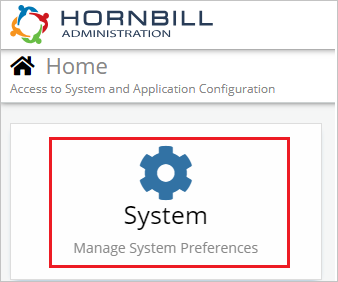
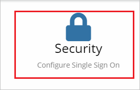
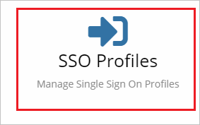
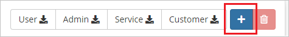
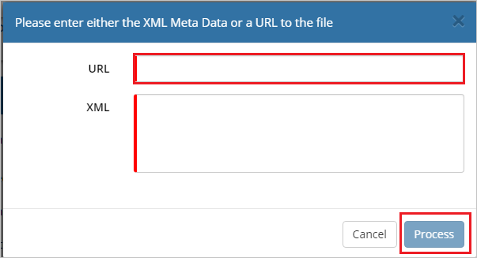
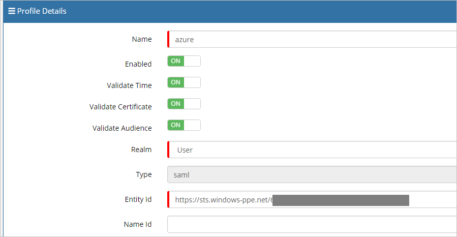
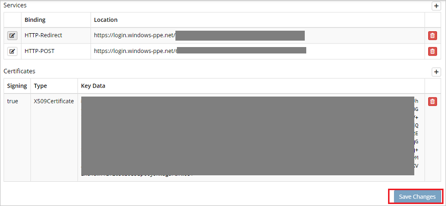
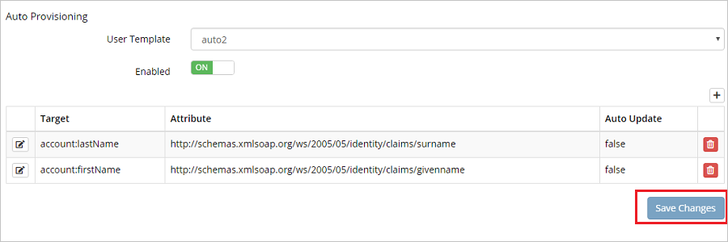

## Prerequisites

To configure Azure AD integration with Hornbill, you need the following items:

- An Azure AD subscription
- A Hornbill single sign-on enabled subscription

> **Note:**
> To test the steps in this tutorial, we do not recommend using a production environment.

To test the steps in this tutorial, you should follow these recommendations:

- Do not use your production environment, unless it is necessary.
- If you don't have an Azure AD trial environment, you can [get a one-month trial](https://azure.microsoft.com/pricing/free-trial/).

### Configuring Hornbill for single sign-on

1. In a different web browser window, log in to Hornbill as a Security Administrator.

2. On the Home page click **System**.

	

3. Navigate to **Security**.

	

4. Click **SSO Profiles**.

	

5. On the right side of the page, click on **Add logo**.

	

6. On the **Profile Details** bar, click on **Import SAML Meta logo**.

	

7. On the Pop-up page in the **URL** text box, paste the **App Federation Metadata Url**, which you have copied from Azure portal and click **Process**.

	

8. After clicking process the values get auto populated automatically under **Profile Details** section.

	

	

	

9. Click **Save Changes**.

## Quick Reference

* **Azure AD Single Sign-On Service URL** : %metadata:singleSignOnServiceUrl%

* **[Download Azure AD Signing Certifcate](%metadata:CertificateDownloadRawUrl%)**

* **[Download SAML Metadata file](%metadata:metadataDownloadUrl%)**

## Additional Resources

* [How to integrate Hornbill with Azure Active Directory](https://docs.microsoft.com/azure/active-directory/saas-apps/hornbill-tutorial)
