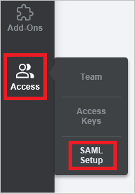
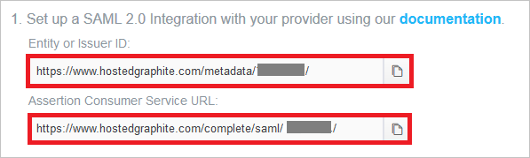
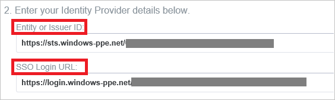
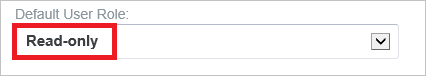
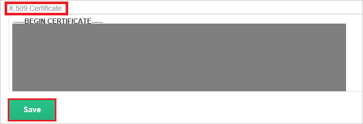

## Prerequisites

To configure Azure AD integration with Hosted Graphite, you need the following items:

- An Azure AD subscription
- A Hosted Graphite single sign-on enabled subscription

> **Note:**
> To test the steps in this tutorial, we do not recommend using a production environment.

To test the steps in this tutorial, you should follow these recommendations:

- Do not use your production environment, unless it is necessary.
- If you don't have an Azure AD trial environment, you can get a one-month trial [here](https://azure.microsoft.com/pricing/free-trial/).

### Configuring Hosted Graphite for single sign-on

1. Sign-on to your Hosted Graphite tenant as an administrator.

2. Go to the **SAML Setup page** in the sidebar (**Access -> SAML Setup**).
   
    

3. Confirm these URls match your configuration done on the **Hosted Graphite Domain and URLs** section of the Azure portal.
   
    

4. In  **Entity or Issuer ID** and **SSO Login URL** textboxes, paste the value of **Azure AD SAML Entity ID** : %metadata:IssuerUri% and **Azure AD Single Sign-On Service URL** : %metadata:singleSignOnServiceUrl% which you have copied from Azure portal. 
   
    
   

5. Select "**Read-only**" as **Default User Role**.
    
    

6. Open your **[Downloaded Azure AD Signing Certificate (Base64 encoded)](%metadata:certificateDownloadBase64Url%)** in notepad, copy the content of it into your clipboard, and then paste it to the **X.509 Certificate** textbox.
    
    

7. Click **Save** button.

## Quick Reference

* **Azure AD Single Sign-On Service URL** : %metadata:singleSignOnServiceUrl%

* **Azure AD SAML Entity ID** : %metadata:IssuerUri%

* **[Download Azure AD Signing Certificate (Base64 encoded)](%metadata:certificateDownloadBase64Url%)**

## Additional Resources

* [How to integrate Hosted Graphite with Azure Active Directory](https://docs.microsoft.com/azure/active-directory/active-directory-saas-hostedgraphite-tutorial)
