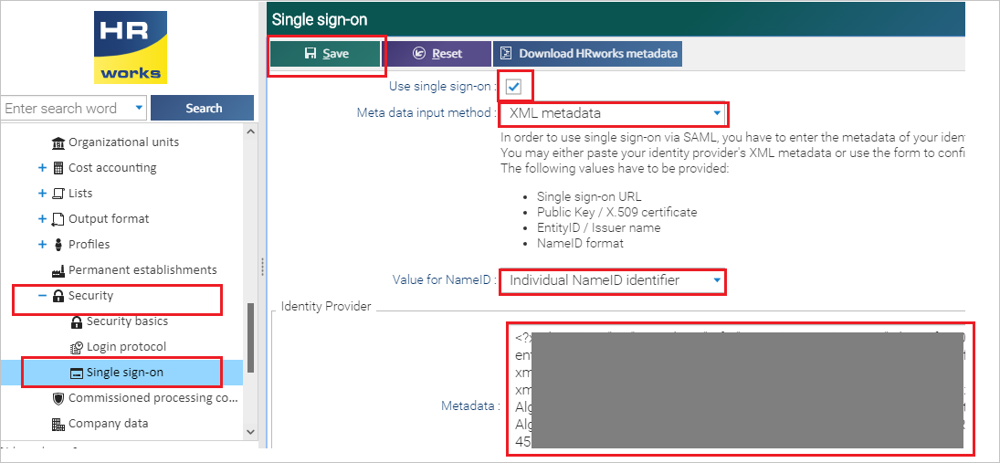

## Prerequisites

To configure Azure AD integration with HRworks Single Sign-On, you need the following items:

- An Azure AD subscription
- A HRworks Single Sign-On single sign-on enabled subscription

> **Note:**
> To test the steps in this tutorial, we do not recommend using a production environment.

To test the steps in this tutorial, you should follow these recommendations:

- Do not use your production environment, unless it is necessary.
- If you don't have an Azure AD environment, you can get a [free account](https://azure.microsoft.com/free/).

### Configuring HRworks Single Sign-On for single sign-on

1. In a different web browser window, sign in to HRworks Single Sign-On as an Administrator.

2. Click on **Administrator** > **Basics** > **Security** > **Single Sign-on** from the left side of menu bar and perform the following steps:

	

	a. Check the **Use Single Sign-on** box.

	b. Select **XML Metadata** as **Meta data input method**.

	c. Select **Individual NameID identifier** as **Value for NameID**.

	d. In Notepad, open the **[Downloaded SAML Metadata file](%metadata:metadataDownloadUrl%)** from the Azure portal, copy its content, and then paste it into the **Metadata** textbox.

	e. Click **Save**.

## Quick Reference

* **Azure AD Login URL** : %metadata:singleSignOnServiceUrl%

* **[Download Azure AD Signing Certifcate](%metadata:CertificateDownloadRawUrl%)**

* **[Download SAML Metadata file](%metadata:metadataDownloadUrl%)**

## Additional Resources

* [How to integrate HRworks Single Sign-On with Azure Active Directory](https://docs.microsoft.com/azure/active-directory/saas-apps/hrworks-single-sign-on-tutorial)
