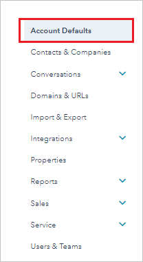

## Prerequisites

To configure Azure AD integration with HubSpot, you need the following items:

- An Azure AD subscription
- A HubSpot single sign-on enabled subscription

> **Note:**
> To test the steps in this tutorial, we do not recommend using a production environment.

To test the steps in this tutorial, you should follow these recommendations:

- Do not use your production environment, unless it is necessary.
- If you don't have an Azure AD trial environment, you can [get a one-month trial](https://azure.microsoft.com/pricing/free-trial/).

### Configuring HubSpot for single sign-on

1. Open a new tab in your browser and log in to your HubSpot administrator account.

2. Click on **settings icon** on the top right corner of the page.

	

3. Click on **Account Defaults**.

	

4. Scroll down to the **Security** section and click on **Set up**.

	

5. On the **Set up single sign-on** section, perform the following steps:

	

	a. Click **copy** button to copy the **Audience URl(Service Provider Entity ID)** value and paste it into the **Identifier** textbox in the **Basic SAML Configuration** section in Azure portal.

	b. Click **copy** button to copy the **Sign on URl,ACS,Recipient, or Redirect** value and paste it into the **Reply URL** textbox in the **Basic SAML Configuration** section in Azure portal.

	c. In the **Identity Provider Identifier or Issuer URL** textbox, paste the **Azure AD Identifier** : %metadata:IssuerUri% value which you have copied from the Azure portal.

	d. In the **Identity Provider Single Sign-On URL** textbox, paste the **Login URL** : %metadata:singleSignOnServiceUrl% value which you have copied from the Azure portal.

	e. Open your **[Downloaded Azure AD Signing Certifcate (Base64 encoded)](%metadata:certificateDownloadBase64Url%)** file in Notepad. Copy the content of it into your clipboard, and then paste it to the **X.509 Certificate** box.

	f. Click **Verify**.

## Quick Reference

* **Azure AD Single Sign-On Service URL** : %metadata:singleSignOnServiceUrl%

* **Azure AD SAML Entity ID** : %metadata:IssuerUri%

* **[Download Azure AD Signing Certifcate (Base64 encoded)](%metadata:certificateDownloadBase64Url%)**

## Additional Resources

* [How to integrate HubSpot with Azure Active Directory](https://docs.microsoft.com/azure/active-directory/saas-apps/hubspot-tutorial)
