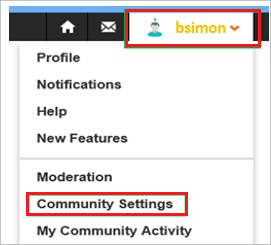
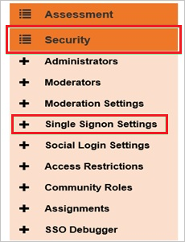
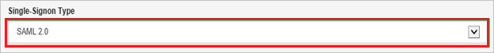
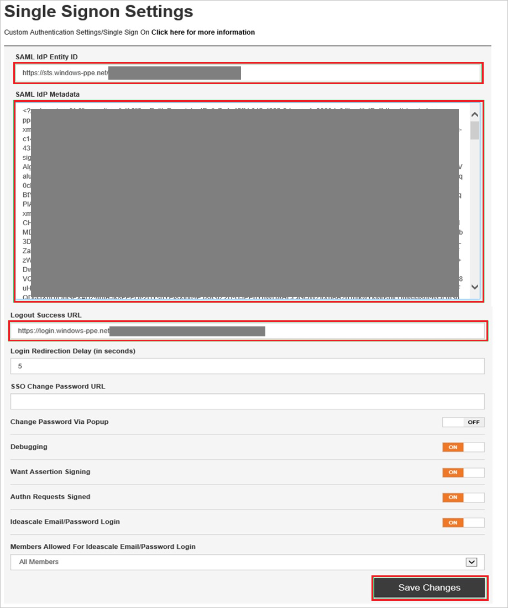

## Prerequisites

To configure Azure AD integration with IdeaScale, you need the following items:

- An Azure AD subscription
- A IdeaScale single-sign on enabled subscription

> **Note:**
> To test the steps in this tutorial, we do not recommend using a production environment.

To test the steps in this tutorial, you should follow these recommendations:

- Do not use your production environment, unless it is necessary.
- If you don't have an Azure AD trial environment, you can get a one-month trial [here](https://azure.microsoft.com/pricing/free-trial/).

### Configuring IdeaScale for single sign-on

1. In a different web browser window, log in to your IdeaScale company site as an administrator.

2. Go to **Community Settings**.
   
    

3. Go to **Security \> Single Signon Settings**.
   
    

4. As **Single-Signon Type**, select **SAML 2.0**.
   
    

5. On the **Single Signon Settings** dialog, perform the following steps:
   
    
   
    a. In **SAML IdP Entity ID** textbox, paste the value of **Azure AD SAML Entity ID** : %metadata:IssuerUri% which you have copied from Azure portal.

    b. Copy the content of your **[Downloaded SAML Metadata file](%metadata:metadataDownloadUrl%)** from Azure portal, and paste it into the **SAML IdP Metadata** textbox.

    c. In **Logout Success URL** textbox, paste the value of **Azure AD Sign Out URL** : %metadata:singleSignOutServiceUrl% which you have copied from Azure portal.

    d. Click **Save Changes**.

## Quick Reference

* **Azure AD Sign Out URL** : %metadata:singleSignOutServiceUrl%

* **Azure AD SAML Entity ID** : %metadata:IssuerUri%

* **[Download SAML Metadata file](%metadata:metadataDownloadUrl%)**

## Additional Resources

* [How to integrate IdeaScale with Azure Active Directory](https://docs.microsoft.com/azure/active-directory/active-directory-saas-ideascale-tutorial)
