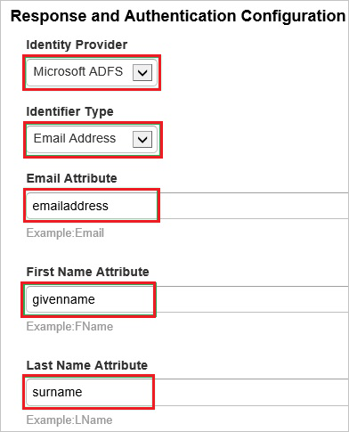
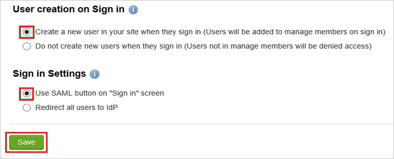

## Prerequisites

To configure Azure AD integration with Igloo Software, you need the following items:

- An Azure AD subscription
- An Igloo Software single sign-on enabled subscription

> **Note:**
> To test the steps in this tutorial, we do not recommend using a production environment.

To test the steps in this tutorial, you should follow these recommendations:

- Do not use your production environment, unless it is necessary.
- If you don't have an Azure AD trial environment, you can get a one-month trial [here](https://azure.microsoft.com/pricing/free-trial/).

### Configuring Igloo Software for single sign-on

1. In a different web browser window, log in to your Igloo Software company site as an administrator.

2. Go to the **Control Panel**.
   
     

3. In the **Membership** tab, click **Sign In Settings**.
   
    

4. In the SAML Configuration section, click **Configure SAML Authentication**.
   
    
   
5. In the **General Configuration** section, perform the following steps:
   
    

    a. In the **Connection Name** textbox, type a custom name for your configuration.
   
    b. In the **IdP Login URL** textbox, paste the value of **Azure AD Single Sign-On Service URL** : %metadata:singleSignOnServiceUrl% which you have copied from Azure portal.
   
    c. In the **IdP Logout URL** textbox, paste the value of **Azure AD Sign Out URL** : %metadata:singleSignOutServiceUrl% which you have copied from Azure portal.
    
    d. Select **Logout Response and Request HTTP Type** as **POST**.
   
    e. Open your **[Downloaded Azure AD Signing Certificate (Base64 encoded)](%metadata:certificateDownloadBase64Url%)** in notepad, copy the content of it into your clipboard, and then paste it to the **Public Certificate** textbox.
    
    
6. In the **Response and Authentication Configuration**, perform the following steps:
    
    
  
      a. As **Identity Provider**, select **Microsoft ADFS**.
      
      b. As **Identifier Type**, select **Email Address**. 

      c. In the **Email Attribute** textbox, type **emailaddress**.

      d. In the **First Name Attribute** textbox, type **givenname**.

      e. In the **Last Name Attribute** textbox, type **surname**.

7. Perform the following steps to complete the configuration:
    
     

     a. As **User creation on Sign in**, select **Create a new user in your site when they sign in**.

     b. As **Sign in Settings**, select **Use SAML button on “Sign in” screen**.

     c. Click **Save**.

## Quick Reference

* **Azure AD Sign Out URL** : %metadata:singleSignOutServiceUrl% 

* **Azure AD Single Sign-On Service URL** : %metadata:singleSignOnServiceUrl%

* **[Download Azure AD Signing Certificate (Base64 encoded)](%metadata:certificateDownloadBase64Url%)**

## Additional Resources

* [How to integrate igloo-software with Azure Active Directory](https://docs.microsoft.com/azure/active-directory/active-directory-saas-igloo-software-tutorial)
