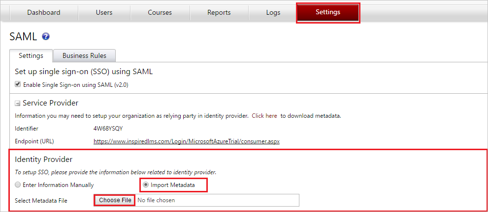
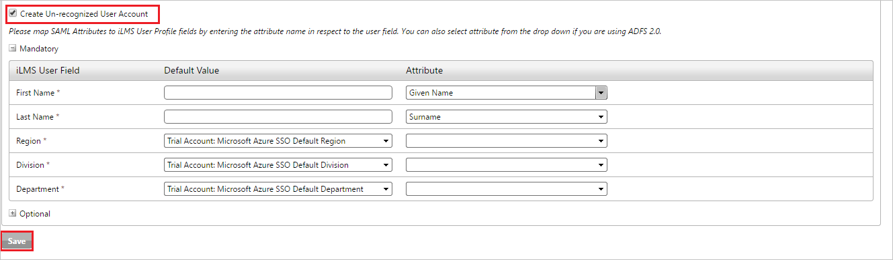

## Prerequisites

To configure Azure AD integration with iLMS, you need the following items:

- An Azure AD subscription
- A iLMS single-sign on enabled subscription

> **Note:**
> To test the steps in this tutorial, we do not recommend using a production environment.

To test the steps in this tutorial, you should follow these recommendations:

- Do not use your production environment, unless it is necessary.
- If you don't have an Azure AD trial environment, you can get a one-month trial [here](https://azure.microsoft.com/pricing/free-trial/).

### Configuring iLMS for single sign-on

1. In a different web browser window, log into your **iLMS admin portal** as an administrator.

2. Click on **SSO:SAML** under **Settings** tab to open SAML settings and perform  the below steps :
    
     
    
    a. Under **Identity Provider** section click on **Import Metadata** radio button.
    
    b. Select the **Metadata** file downloaded from Azure AD Portal under **Select Metadata File**.

3. Optionally you can enable un-recognized user account using the following steps :
  
	      
    a. Map the attributes in Azure AD with the attributes in iLMS. 
   
    b. Create the corresponding attributes for Department, Region and Division in    Azure AD and add the name of the attribute in iLMS.

4. Click on **Save** button to save the settings.

## Quick Reference

* **[Download SAML Metadata file](%metadata:metadataDownloadUrl%)**

## Additional Resources

* [How to integrate iLMS with Azure Active Directory](active-directory-saas-ilms-tutorial.md)
